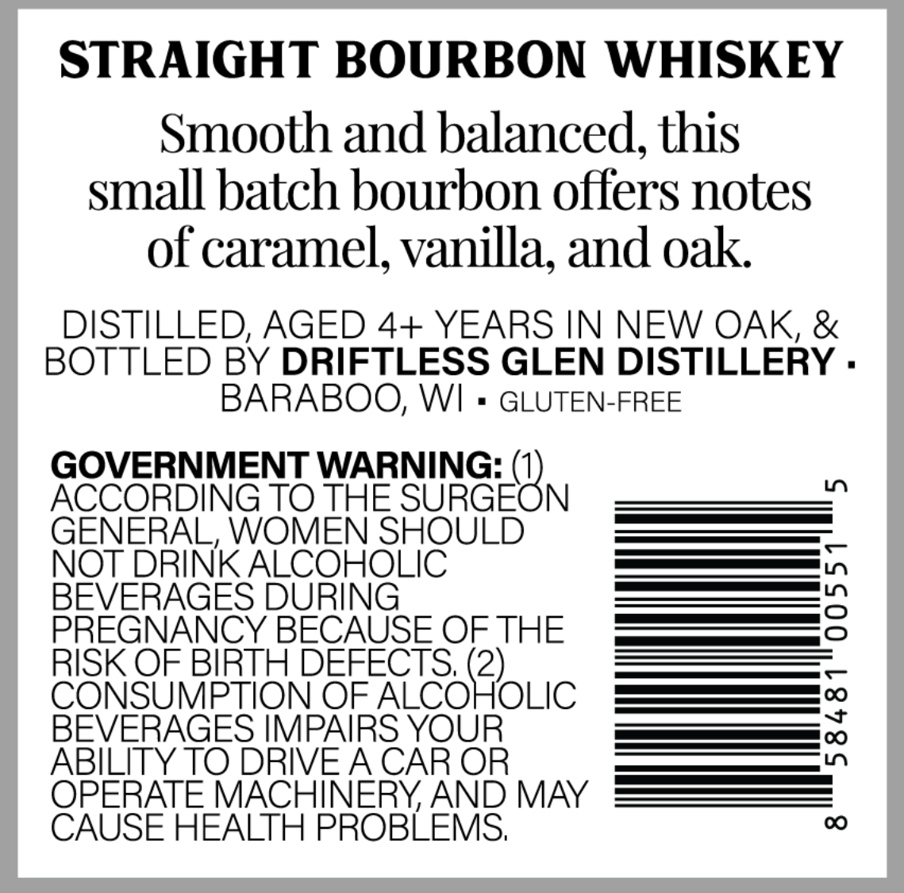

# TTB COLA Label Images - TTBID 26134001000280

**Brand Name:** WATERFRONT WAREHOUSE

**Issue Date:** 05/19/2026

**Origin Code:** 48

**Product Class/Type:** 101

**Source:** [TTB Public COLA Registry](https://ttbonline.gov/colasonline/viewColaDetails.do?action=publicFormDisplay&ttbid=26134001000280)

## Label Images

### Front Label

## Extracted Label Text

*Text extracted via OCR - may contain errors*

### Front Label

STRAIGHT BOURBON WHISKEY
Smooth and balanced, this
small batch bourbon offers notes
of caramel, vanilla; and oak
DISTILLED, AGED 4+ YEARS IN NEW OAK, &
BOTTLED BY DRIFTLESS GLEN DISTILLERY .
BARABOO; WI
GLUTEN-FREE
GOVERNMENT WARNING: (1)
0
ACCORDING TO THE SURGEON
GENERAL, WOMEN SHOULD
NOT DRINK ALCOHOLIC
BEVERAGES DURING
2
PREGNANCY BECAUSE OFTHE
RISK OF BIRTH DEFECTS; (2)
CONSUMPTION OF ALCOHOLIC
BEVERAGES IMPAIRS YOUR
1
ABILITY TO DRIVEACAR OR
OPERATE MACHINERYAND MAY
CAUSE HEALTH PROBLEMS;
0
