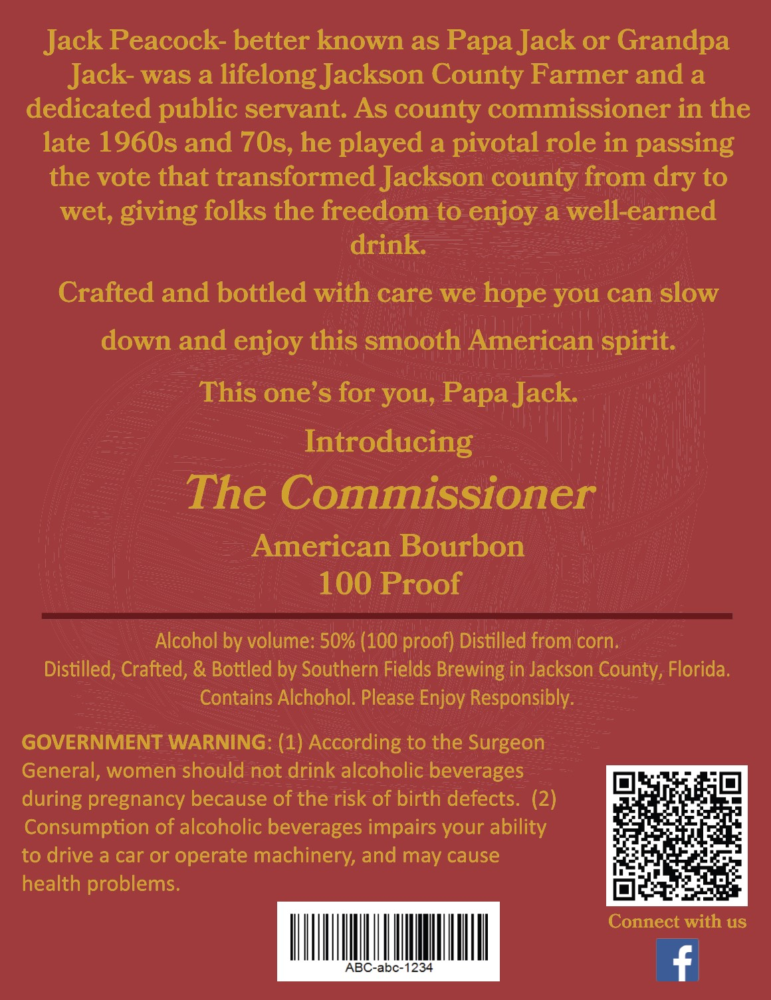
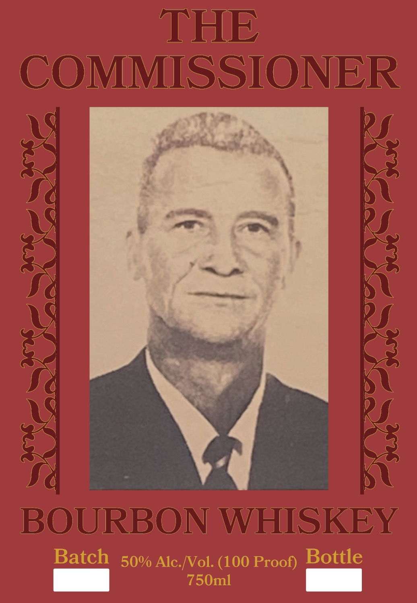

# TTB COLA Label Images - TTBID 26134001000301

**Brand Name:** SOUTHERN FIELDS BREWING

**Fanciful Name:** THE COMMISSIONER

**Issue Date:** 06/01/2026

**Origin Code:** 16

**Product Class/Type:** 141

**Source:** [TTB Public COLA Registry](https://ttbonline.gov/colasonline/viewColaDetails.do?action=publicFormDisplay&ttbid=26134001000301)

## Label Images

### Back Label

### Front Label

## Extracted Label Text

*Text extracted via OCR - may contain errors*

*1 image(s) excluded: text did not meet readability threshold*

**Detected Proof:** 100

### Back Label

Jack Peacock- better known as Papa Jack or Grandpa

Jack- was a lifelong Jackson County Farmer and a

dedicated public servant. As county commissioner in the

late 1960s and 70s, he played a pivotal role in passing

the vote that transformed Jackson county from dry to

wet, giving folks the freedom to enjoy a well-earned

drink.

Crafted and bottled with care we hope you can slow

down and enjoy this smooth American spirit.

This one’s for you, Papa Jack.

Introducing

The Commissioner

American Bourbon

100 Proof

Alcohol by volume: 50% (100 proof) Distilled from'corn.

Distilled, Crafted, & Bottled by Southern Fields Brewing in Jackson County, Florida.

Contains Alchohol. Please Enjoy Responsibly.

GOVERNMENT WARNING: (1) According to the Surgeon

General, women should not drink alcoholic beverages

beers

during pregnancy because of the risk of birth defects. (2)

Consumption of alcoholic beverages impairs your ability

to drive a car or operate machinery, and may cause

health problems.

ine

and

Connect with us

5

00

4

f
