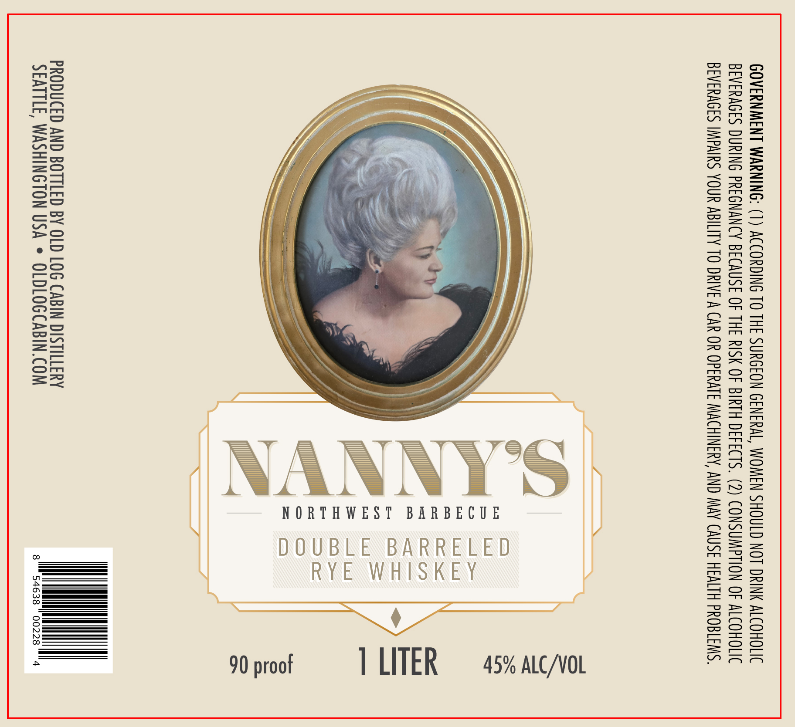

# TTB COLA Label Images - TTBID 26134001000305

**Brand Name:** NANNY'S

**Issue Date:** 05/22/2026

**Origin Code:** 07

**Product Class/Type:** 142

**Source:** [TTB Public COLA Registry](https://ttbonline.gov/colasonline/viewColaDetails.do?action=publicFormDisplay&ttbid=26134001000305)

## Label Images

### Label 1

## Extracted Label Text

*Text extracted via OCR - may contain errors*

### Label 1

GOVERNMENT WARNING: (1) ACCORDING TO THE SURGEON GENERAL, WOMEN SHOULD NOT DRINK ALCOHOLIC
BEVERAGES DURING PREGNANCY BECAUSE OF THE RISK OF BIRTH DEFECTS. (2) CONSUMPTION OF ALCOHOLIC
BEVERAGES IMPAIRS YOUR ABILITY TO DRIVE A CAR OR OPERATE MACHINERY, AND MAY CAUSE HEALTH PROBLEMS.

NORTHWEST BARBECUE

PRODUCED AND BOTTLED BY OLD LOG CABIN DISTILLERY
SEATTLE, WASHINGTON USA * OLDLOGCABIN.COM 54638 | 00228 "4
