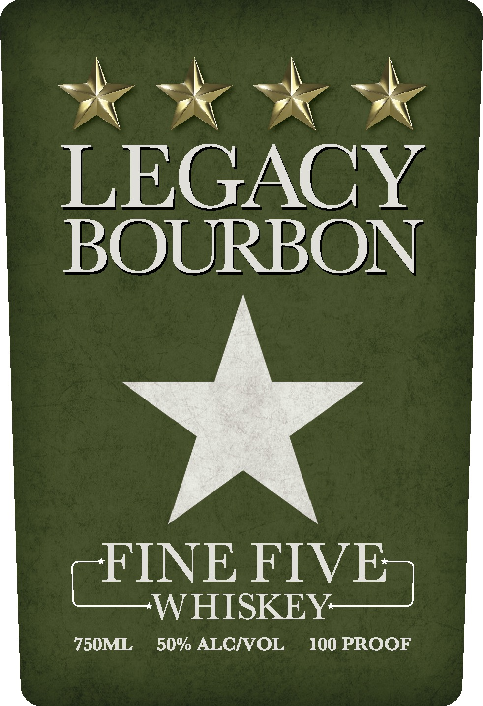
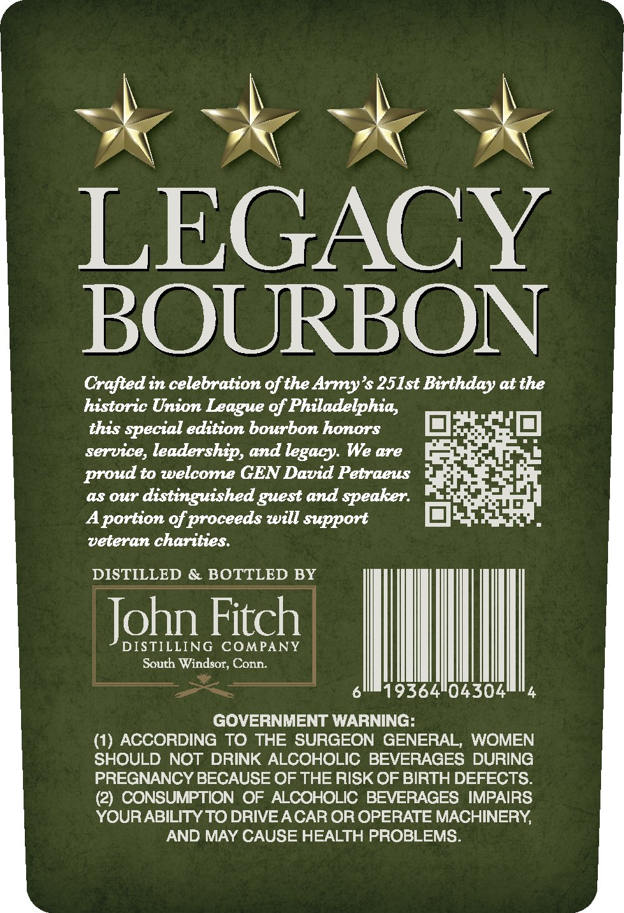

# TTB COLA Label Images - TTBID 26134001000306

**Brand Name:** LEGACY BOURBON

**Fanciful Name:** FINE FIVE WHISKEY

**Issue Date:** 05/19/2026

**Origin Code:** 14

**Product Class/Type:** 141

**Source:** [TTB Public COLA Registry](https://ttbonline.gov/colasonline/viewColaDetails.do?action=publicFormDisplay&ttbid=26134001000306)

## Label Images

### Label 1

### Label 2

## Extracted Label Text

*Text extracted via OCR - may contain errors*

### Label 1

LEGACY
BOURBON

FINE FIVE
WHISKEY

### Label 2

LEGACY
BOUURBON
Crafted in celebration ofthe Army's 251st Birthday atthe
historic Union League of Philadelphia,
this
special edition bourbon honors
service, leadership, and legacy We are
proud to welcome GEN David Petraeus
aS 0ur
distinguished guest and speaker.
Aportion of proceeds will support
veteran charities:
DISTILLED
BOTTLED BY
John Fitch
DISTILLING
COMPANY
South Windsor, Conn
19364104304
GOVERNMENT WARNING:
(1
ACCORDING TO THE SURGEON GENERAL
WOMEN
SHOULD NOT DRINK ALCOHOLIC BEVERAGES DURING
PREGNANCY BECAUSE OF THE RISK OF BIRTH DEFECTS.
(2) CONSUMPTION OF ALCOHOLIC BEVERAGES IMPAIRS
YOURABILITY TO DRIVE ACAR OR OPERATE MACHINERY
AND MAY CAUSE HEALTH PROBLEMS.
