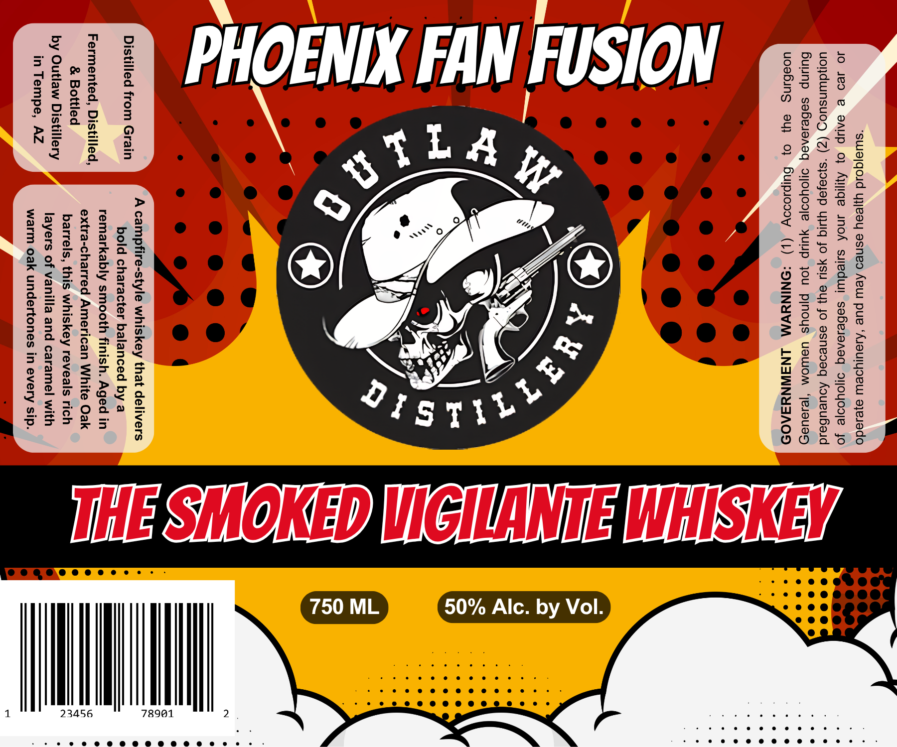

# TTB COLA Label Images - TTBID 26134001000419

**Brand Name:** OUTLAW DISTILLERY

**Issue Date:** 05/20/2026

**Origin Code:** 11

**Product Class/Type:** 140

**Source:** [TTB Public COLA Registry](https://ttbonline.gov/colasonline/viewColaDetails.do?action=publicFormDisplay&ttbid=26134001000419)

## Label Images

### Label 1

## Extracted Label Text

*Text extracted via OCR - may contain errors*

**Detected Proof:** 100

### Label 1

“swia|qoid yyeay asneo Aew pue ‘Aaulysew a}ejado

JO Jed @ SAUP 0} Ayiqe INO sured sebe1aAeq oOYyoo|e jo
> uoldunsuog (Z) ‘s}oayap YYIG Jo YSU Ou} Jo asnesaq Aoueubaid
Bulinp seBeJereq o1oyooje YULIP JOU Pinoys UaWOM ‘|eJaUaSs)
uoabing ey} 0} Bulpicooy (1) :ONINYVM LNAINNYSAO9D

0° @ @ @@
e@ ef

by Vol.

50% Alc.

N e
e e@ e @ —————— e°
—_—<— °
—< C
ee @ 1 a
—_______.S e
es 3. e
—_ . A campfire-style whiskey that delivers ===" _
lorisiilliga! tien erect) bold character balanced by a ss e
— remarkably smooth finish. Aged in }————_________} c
re a extra-charred American White Oak —_—_—_—_ a °
° e . barrels, this whiskey reveals rich a ~ i
by Outlaw Distillery) layers of vanilla and caramel with —_—_————E
TH CTI (re warm oak undertones in every sip. ——@—
al
