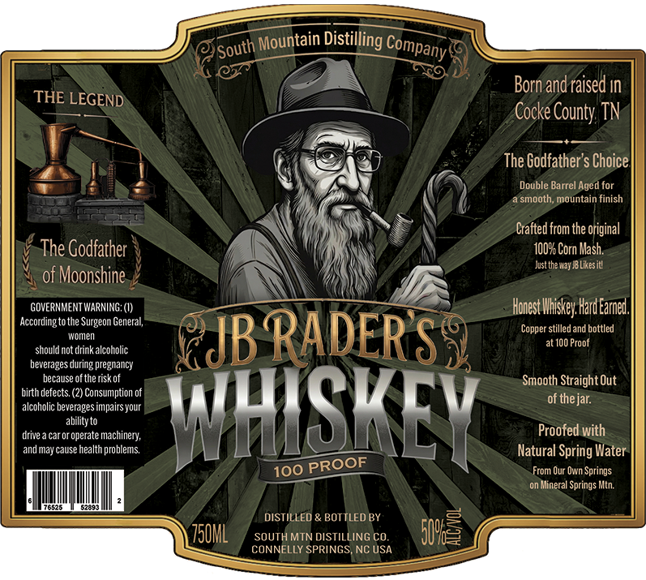

# TTB COLA Label Images - TTBID 26134001000423

**Brand Name:** JB RADER'S WHISKEY

**Issue Date:** 05/29/2026

**Origin Code:** 35

**Product Class/Type:** 140

**Source:** [TTB Public COLA Registry](https://ttbonline.gov/colasonline/viewColaDetails.do?action=publicFormDisplay&ttbid=26134001000423)

## Label Images

### Label 1

## Extracted Label Text

*Text extracted via OCR - may contain errors*

### Label 1

Born andraised In
THE LEGEND
Cocke County TN
The Godfather'$ Choice
Double Barrel Aged for
smooth; mountain finish
Crafted from the original
The Godfather
1009 Corn Mash.
Just theway  Likesitl
of Moonshine
GOVERNMENT WARNING; (I)
Honest Whiskey Hard Eared,
According to the Surgeon General;
Copper stilled and bottled
should notanekalcoholic
JBRADERS
at 10O Proof
beverages during pregnancy
because of the risk of
Smooth Straight Out
birth defects (2) Consumption of
of thejar:
alcoholic beverages
our
drive =
carororerate mackinery
WHISKEY
Proofed with
and may cause =
problems
Natural Spring Water
100
From Our Own Springs
on Mineral Springs Mtn:
75575
DISTILLED & BOTTLED BY
750ML
SOUTH MTN DISTILE
ING CO_
S0E
CONNELLY SPRINGS NC USA
Mountain
Distilling `
Company'
South
Impairs_
health
PROOF
