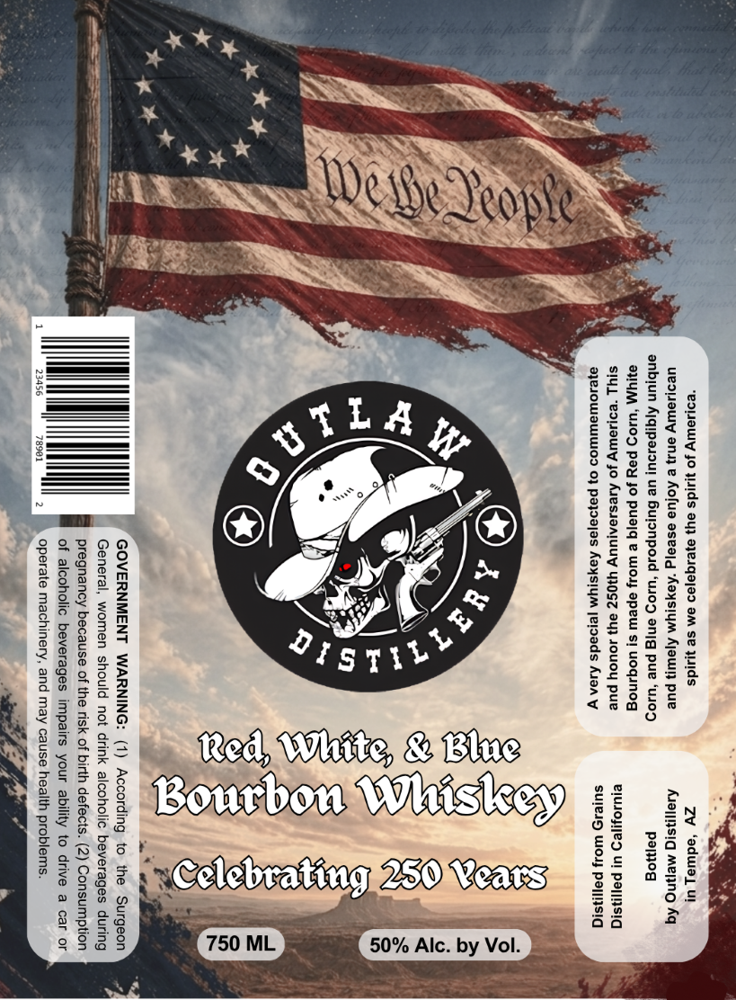

# TTB COLA Label Images - TTBID 26134001000473

**Brand Name:** OUTLAW DISTILLERY

**Issue Date:** 05/19/2026

**Origin Code:** 11

**Product Class/Type:** 141

**Source:** [TTB Public COLA Registry](https://ttbonline.gov/colasonline/viewColaDetails.do?action=publicFormDisplay&ttbid=26134001000473)

## Label Images

### Label 1

## Extracted Label Text

*Text extracted via OCR - may contain errors*

**Detected Proof:** 100

### Label 1

“eopieuuly Jo yids ay) ayeiqajeo am se yids Zw ‘eduiay ut

ueoewry ensj e Aofue eseejg ‘Aoysiym Ajawy pue Asansig Meng Aq
enbjun Aiqipesouy ue Bujonpoud ‘wio9 enig pue ‘uso5, pemog
@UYM “U10D poy Jo pue|q e Woy epew s} UOGINog

SIYL “eo yay Jo Aressonjuuy yy0Sz eu) JOUCY pue eyUsOH1eD UI PetINsIG
aye10ULaUIWIOD 0} payajas Kays!yM [eIoads Alon y sujesd wo. po}

ep

VV

50% Alc. by Vol.

c.

{4

cb Whe, & B
ourbor

iy
Bi

Si)
GOVERNMENT WARNING: (1) According to the Surgeon
General, women should not drink alcoholic beverages during

pregnancy because of the risk of birth defects. (2) Consumption
of alcoholic beverages impairs your ability to drive a car or
