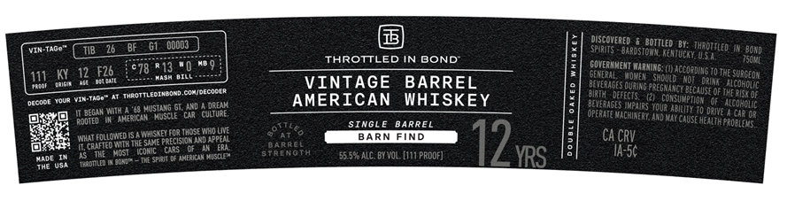
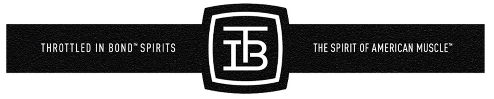

# TTB COLA Label Images - TTBID 26134001000596

**Brand Name:** THROTTLED IN BOND

**Issue Date:** 05/21/2026

**Origin Code:** 22

**Product Class/Type:** 140

**Source:** [TTB Public COLA Registry](https://ttbonline.gov/colasonline/viewColaDetails.do?action=publicFormDisplay&ttbid=26134001000596)

## Label Images

### Label 1

### Label 2

## Extracted Label Text

*Text extracted via OCR - may contain errors*

### Label 1

WIN-Taoe"
ooodj
DuSeoverer BstoottLed BE; "hrottled
~Bowd=
THROTTLED IN BOND
reriucey Usa
T5qVI
111
12   F26
c78 RaS? BIQ
GOVERaHENToVErWING;
DUaceoroG To TXE Surgeon
VINTAGE
BARREL
~Beverages _
Should
Tdrink . AIcohclc
Jour VIM-TaD"
ThRoTTLEDINEOND cowidecocer
AMERICAN
WHISKEY
Birth   defects.
scuring PpegnayCy BECausE OF
RiSk Of
decoor
husTanj GT Akd
DREAK
OpferagEs thntRS YoUz AehIft oO DQFVE ACoHolg
Dis
Robfed " MothkeRIC MusiscLe"car
CultURE;
OpeRate MachIneRT; And [
Dalve
car 0R
ROOTED
SINGLE
BARREL
'CaUSE HealtH ppoblems
Fokowedksae SaSE eyECSThOSeWap Une
~to
BARN
FIND
CA CRV
caLFiu F
barRCL
Vane
HosI
Jcnic
[oS HEFcan
stc
PEaGTI
55.592 ALC Bx VOL_ [111 PRDOF]
YRS
~Ia-56
I-aditled M oone
Shan
Cons uptinn

### Label 2

THROTTLED IN BOND" SPIRITS
IB
THE SPIRIT OF AMERICAN MUSCLE
