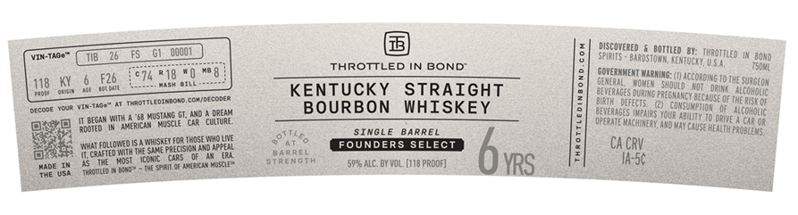
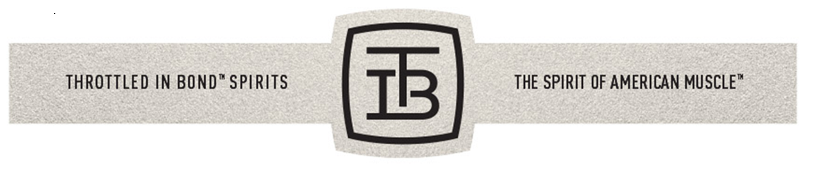

# TTB COLA Label Images - TTBID 26134001000617

**Brand Name:** THROTTLED IN BOND

**Issue Date:** 05/20/2026

**Origin Code:** 22

**Product Class/Type:** 101

**Source:** [TTB Public COLA Registry](https://ttbonline.gov/colasonline/viewColaDetails.do?action=publicFormDisplay&ttbid=26134001000617)

## Label Images

### Label 1

### Label 2

## Extracted Label Text

*Text extracted via OCR - may contain errors*

### Label 1

discoverEd
boitlED
VIN-TaGc"
spiris
baRDSTOAN
thAOITlED
THROTTLED IN BOND"
entuCKT, USA,
Teo4L
F26
c74 R18
Kb 8
CoverNMENT WarninG:
McCorOING TO THE Surseon
118
KEnTUCKY
STRAIGHT
Olneraly
NqVen  should
aji   drink
TrrotilEdIndOYC
COiDicoder
#everages DuRIMS
'PREGMaNCY BECAusE OfThE RSOC
VIN-g
BOURBON
WHISKEY
DEFECIS   (2)
CONSUMPTUOH
IT BeGan With
MUSiANG
CuERGay
OfuateMachpare Hounen to Dewe M4COHDOS
american
Viscue
OPERATE MACHURERU; A4D MaY Cause
Rooied
SInGL
BARREL
health Probleys,
fclloweo
ikisKAI
Saka precisicy Ano AF?EAL
[KoSe Whoue
~ l
FOUNDERS SELECT
Ca CRV
75
Ms ThEc
cars
CTRENGTA
ARREL
bys
Ia-5c
MadC
The Sfirii Cf amiacn Muscle"
5992 AlC_ BX VOL_ (018 proof]
Ihenmneg
0odo]
Miconcikc
Auat
elcoat

### Label 2

THROTTLED IN BOND” SPIRITS

THE SPIRIT OF AMERICAN MUSCLE”

1B
