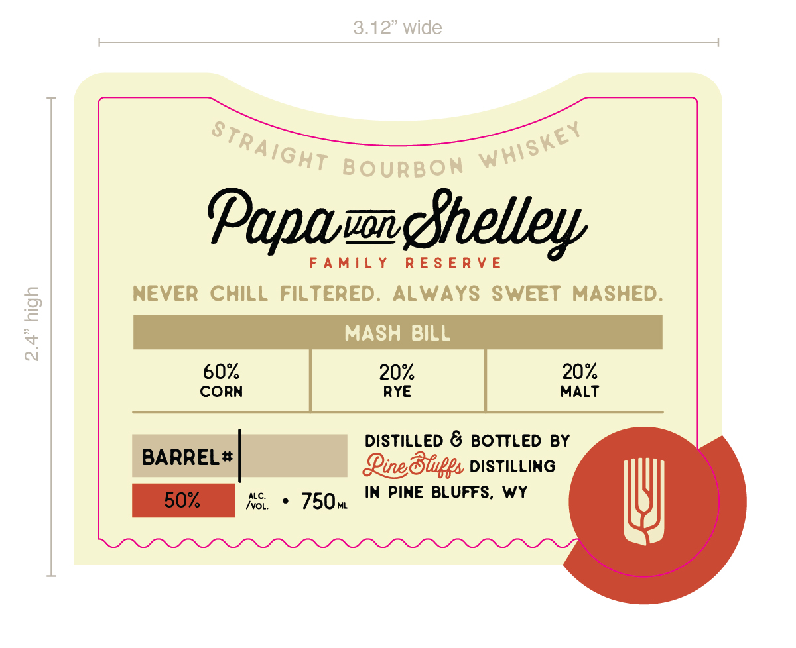

# TTB COLA Label Images - TTBID 26134001000647

**Brand Name:** PINE BLUFFS DISTILLING

**Fanciful Name:** PAPA VON SHELLEY FAMILY RESERVE

**Issue Date:** 05/19/2026

**Origin Code:** 22

**Product Class/Type:** 101

**Source:** [TTB Public COLA Registry](https://ttbonline.gov/colasonline/viewColaDetails.do?action=publicFormDisplay&ttbid=26134001000647)

## Label Images

### Back Label

### Front Label

### Label 4

## Extracted Label Text

*Text extracted via OCR - may contain errors*

*2 image(s) excluded: text did not meet readability threshold*

### Front Label

Popamgfhelley
FAMILY RESERVE
NEVER CHILL FILTERED. ALWAYS SWEET MASHED.
MASH BILL

CORN RYE MALT

_ DISTILLED & BOTTLED BY
BARREL# Qing Blips DISTILLING
50% AS 6 750 IN PINE BLUFFS, WY W)
