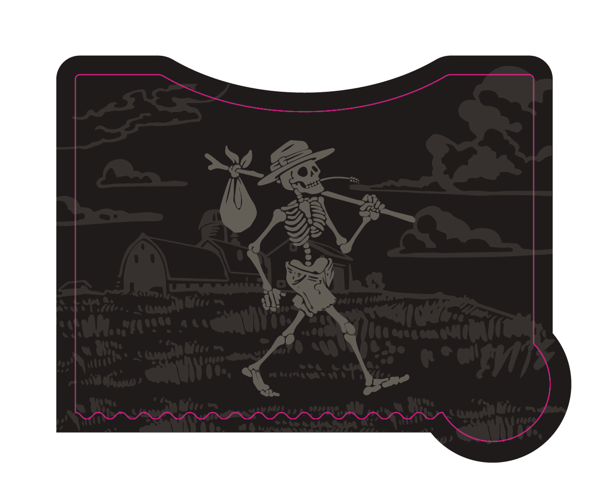
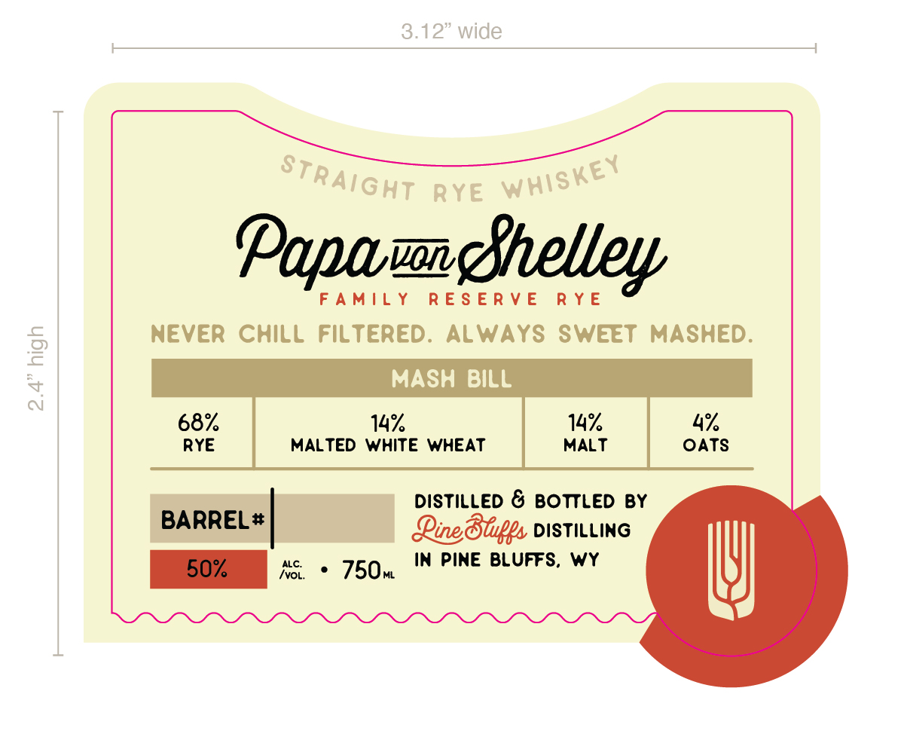

# TTB COLA Label Images - TTBID 26134001000648

**Brand Name:** PINE BLUFFS DISTILLING

**Fanciful Name:** PAPA VON SHELLEY FAMILY RESERVE RYE

**Issue Date:** 05/20/2026

**Origin Code:** 49

**Product Class/Type:** 102

**Source:** [TTB Public COLA Registry](https://ttbonline.gov/colasonline/viewColaDetails.do?action=publicFormDisplay&ttbid=26134001000648)

## Label Images

### Back Label

### Front Label

### Label 4

## Extracted Label Text

*Text extracted via OCR - may contain errors*

*2 image(s) excluded: text did not meet readability threshold*

### Front Label

Papamghhelley
FAMILY RESERVE RYE
NEVER CHILL FILTERED. ALWAYS SWEET MASHED.
MASH BILL
RYE MALTED WHITE WHEAT MALT OATS
~ DISTILLED & BOTTLED BY
BARREL# Qing Blips DISTILLING
50% AS «750, IN PINE BLUFFS, WY }
