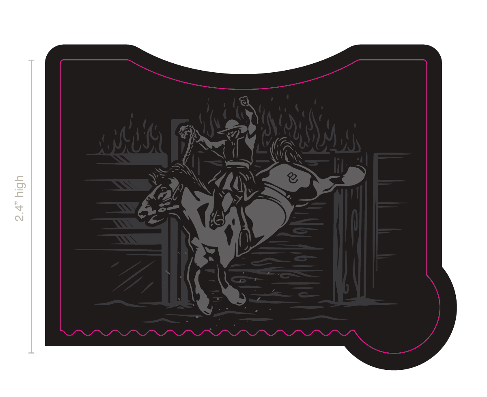
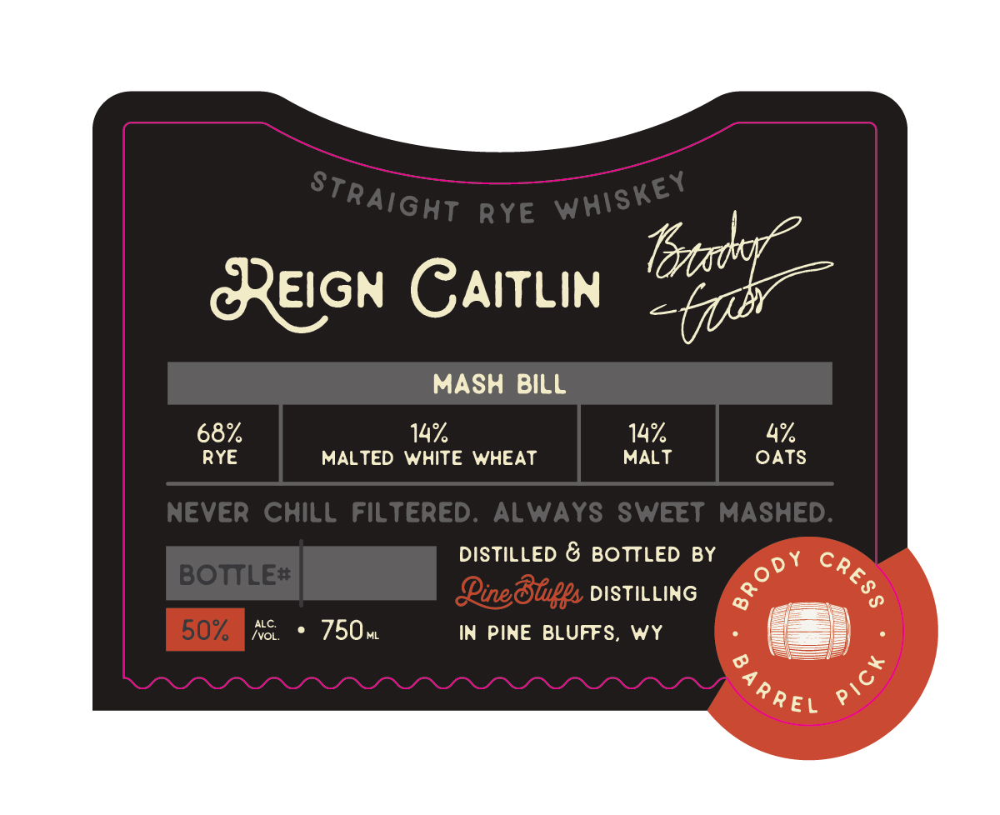

# TTB COLA Label Images - TTBID 26134001000653

**Brand Name:** PINE BLUFFS DISTILLING

**Fanciful Name:** REIGN CAITLIN

**Issue Date:** 05/19/2026

**Origin Code:** 39

**Product Class/Type:** 102

**Source:** [TTB Public COLA Registry](https://ttbonline.gov/colasonline/viewColaDetails.do?action=publicFormDisplay&ttbid=26134001000653)

## Label Images

### Back Label

### Front Label

### Label 4

## Extracted Label Text

*Text extracted via OCR - may contain errors*

*2 image(s) excluded: text did not meet readability threshold*

**Detected Proof:** 136

### Front Label

Rye
CEIGN GAITLIN
Totaokl
MASH
BILL
68%
14%
14
4%
RYE
MALTED WHITE WHEAT
MALT
OATS
Never ChilL filtered.
ALWAYS SwEET MASHED:
DISTILLED & BOTTLED BY
BOTTLE#
Qineduupps DISTILLING
0
d
ALC.
50%
Ivo
750,
IN PINE BLUFFS,
Wy
7
Straight
Whiskey
DY
CRES
2
R reL
