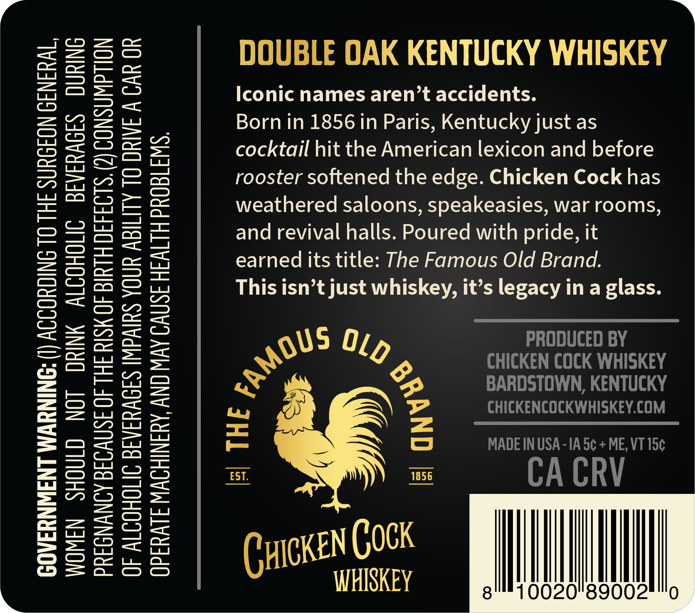
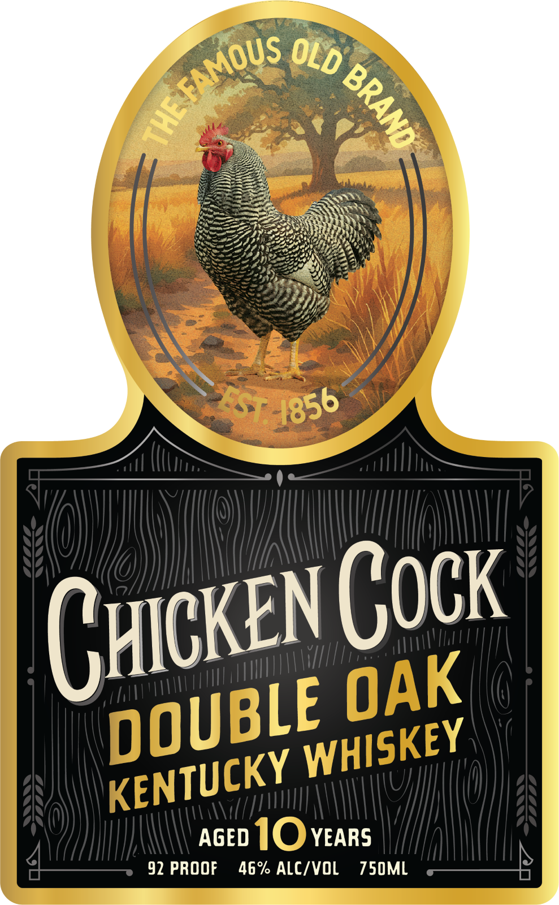

# TTB COLA Label Images - TTBID 26134001000674

**Brand Name:** CHICKEN COCK

**Issue Date:** 06/22/2026

**Origin Code:** 35

**Product Class/Type:** 140

**Source:** [TTB Public COLA Registry](https://ttbonline.gov/colasonline/viewColaDetails.do?action=publicFormDisplay&ttbid=26134001000674)

## Label Images

### Back Label

### Front Label

### Label 3

## Extracted Label Text

*Text extracted via OCR - may contain errors*

*1 image(s) excluded: text did not meet readability threshold*

**Detected Proof:** 92

### Back Label

>»
DOUBLE OAK KENTUCKY WHISKEY

Iconic names aren’t accidents.

Born in 1856 in Paris, Kentucky just as
cocktail hit the American lexicon and before
rooster softened the edge. Chicken Cock has
weathered saloons, speakeasies, war rooms,
and revival halls. Poured with pride, it
earned its title: The Famous Old Brand.

This isn’t just whiskey, it’s legacy in a glass.

5 PRODUCED BY
Ry QXg CHICKEN COCK WHISKEY

BARDSTOWN, KENTUCKY
CHICKENCOCKWHISKEY.COM

MADE IN USA -1A 5¢ + ME, VT 15¢

CA CRV

| THE ¢
| anwe?

m
w
—

=
o
wu
a

WOMEN SHOULD NOT DRINK ALCOHOLIC BEVERAGES DURING
PREGNANCY BECAUSE OF THE RISK OF BIRTH DEFECTS. (2) CONSUMPTION
OF ALCOHOLIC BEVERAGES IMPAIRS YOUR ABILITY TO DRIVE A CAR OR

GOVERNMENT WARNING: (I) ACCORDING TO THE SURGEON GENERAL,
OPERATE MACHINERY, AND MAY CAUSE HEALTH PROBLEMS.

Ciexen Cock Hl
WHISKEY alll} 0020!'g9002Hlllo

### Front Label

Cuicken Cock
AGED IOYEARS
92 PROOF
46% ALC/VOL
750ML
FAMOUS
OLD
{
F
4856
E
OAK
DOUBLE
WHISKEY
KENTUCKY
