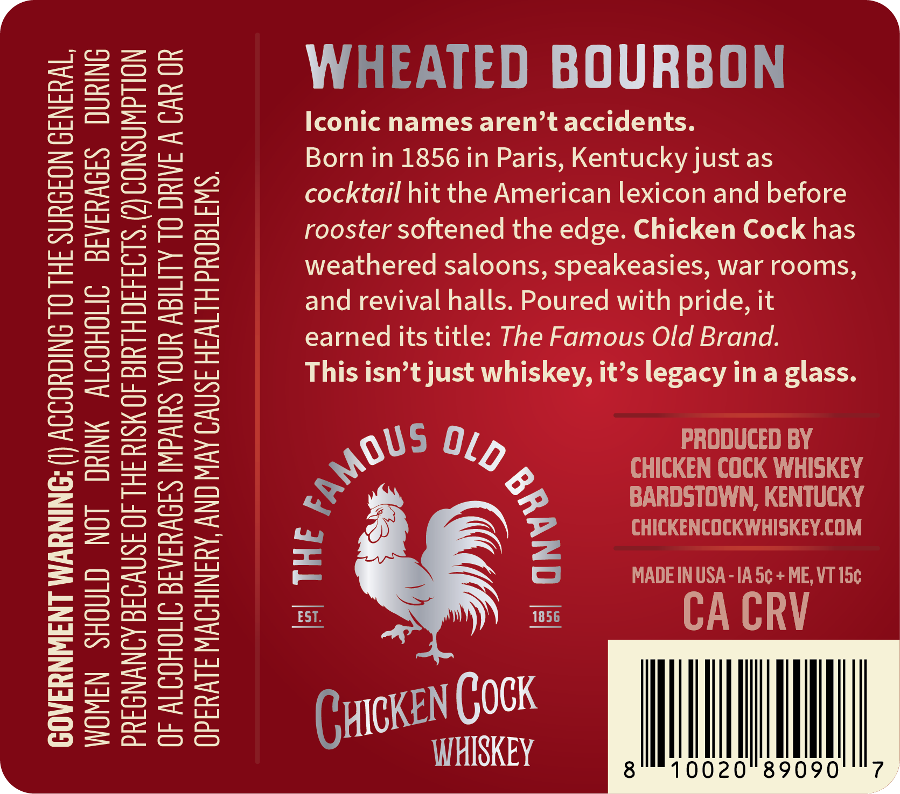
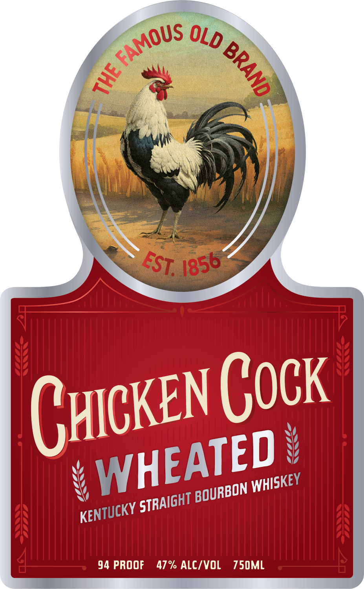

# TTB COLA Label Images - TTBID 26134001000688

**Brand Name:** CHICKEN COCK

**Issue Date:** 06/23/2026

**Origin Code:** 35

**Product Class/Type:** 101

**Source:** [TTB Public COLA Registry](https://ttbonline.gov/colasonline/viewColaDetails.do?action=publicFormDisplay&ttbid=26134001000688)

## Label Images

### Back Label

### Front Label

### Label 2

## Extracted Label Text

*Text extracted via OCR - may contain errors*

*1 image(s) excluded: text did not meet readability threshold*

**Detected Proof:** 94

### Back Label

mo

WOMEN SHOULD NOT DRINK ALCOHOLIC BEVERAGES DURING
PREGNANCY BECAUSE OF THE RISK OF BIRTH DEFECTS. (2) CONSUMPTION
OF ALCOHOLIC BEVERAGES IMPAIRS YOUR ABILITY TO DRIVE A CAR OR

GOVERNMENT WARNING: (|) ACCORDING TO THE SURGEON GENERAL,
OPERATE MACHINERY, AND MAY CAUSE HEALTH PROBLEMS.

>»
WHEATED BOURBON

Iconic names aren’t accidents.

Born in 1856 in Paris, Kentucky just as
cocktail hit the American lexicon and before
rooster softened the edge. Chicken Cock has
weathered saloons, speakeasies, war rooms,
and revival halls. Poured with pride, it
earned its title: The Famous Old Brand.

This isn’t just whis legacy ina glass.

g5 Oy PRODUCED BY
> CHICKEN COCK WHISKEY
BARDSTOWN, KENTUCKY

CHICKENCOCKWHISKEY.COM

MADE IN USA -1A 5¢ + ME, VT 15¢

| THE fy
| awe

=
o
a
a

CyreKeN COCK TM
WHISKEY 8" 10020 89090 “7

### Front Label

Gucken Cock
94 PROOF
47% ALC/VOL
750ML
FAMOUS
OLD
1
F
e56
FEST,
WHEATED
WHISKEY
BOURBON
STRAIGHT
KENTUCKY
