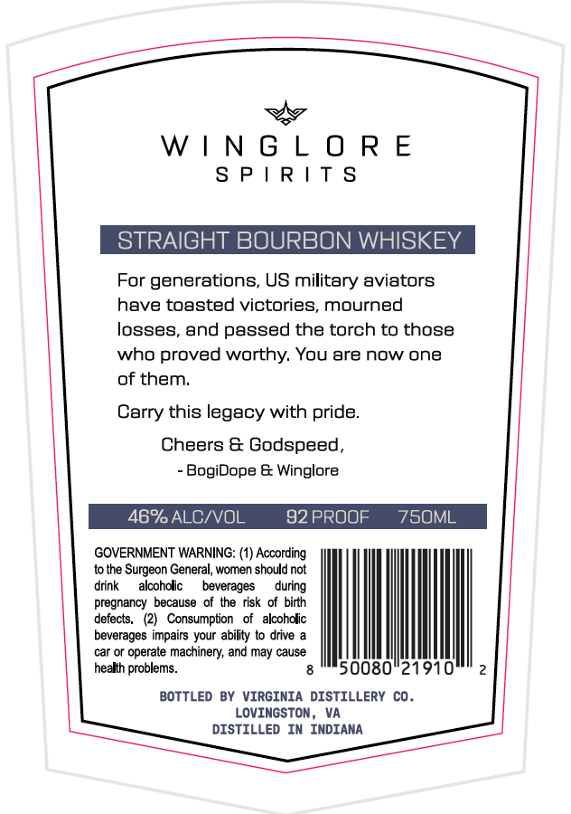
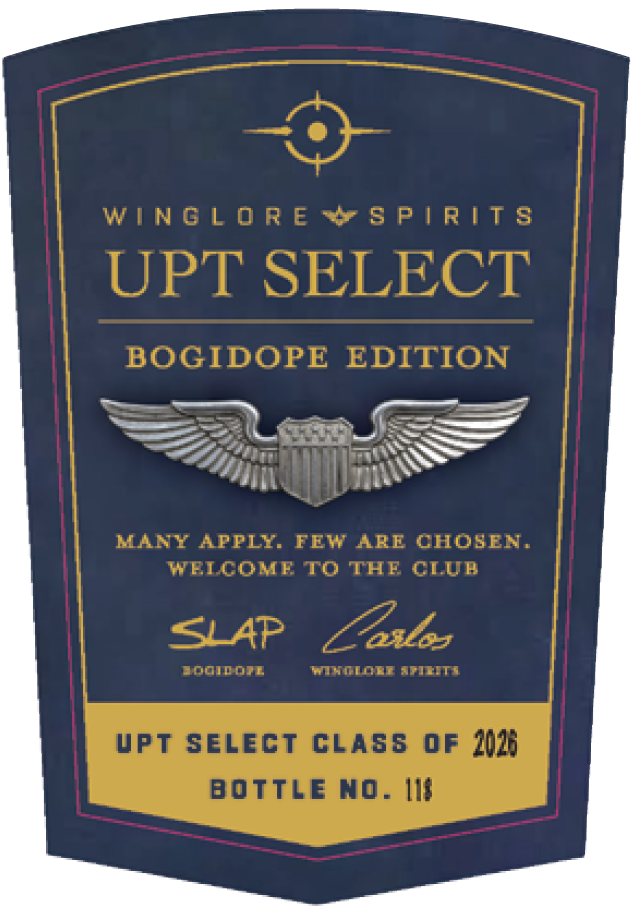
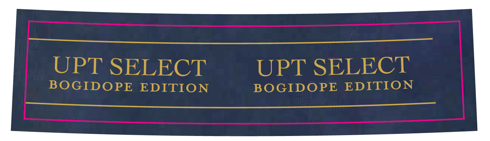

# TTB COLA Label Images - TTBID 26134001000739

**Brand Name:** WINGLORE SPIRITS

**Fanciful Name:** UPT SELECT

**Issue Date:** 05/20/2026

**Origin Code:** 05

**Product Class/Type:** 101

**Source:** [TTB Public COLA Registry](https://ttbonline.gov/colasonline/viewColaDetails.do?action=publicFormDisplay&ttbid=26134001000739)

## Label Images

### Back Label

### Front Label

### Label 2

## Extracted Label Text

*Text extracted via OCR - may contain errors*

**Detected Proof:** 92

### Back Label

WINGLORE
SPIRI

STRAIGHT BOURBON WHISKEY

For generations, US military aviators
have toasted victories, mourned
losses, and passed the torch to those
who proved worthy. You are now one
of them.
Carry this legacy with pride.
Cheers & Godspeed,
- BogiDope & Winglore
46% ALC/VOL 92PROOF  7S5OML

GOVERNMENT WARNING: (1) According

tothe Surgeon General, women should not
drink alcoholic beverages during
On 2

pregnancy because of the risk of birth
defects, (2) Consumption of alcoholic
beverages impairs your abilty to drive a
car or operate machinery, and may cause
health problems. g © 50080°219

BOTTLED BY VIRGINIA DISTILLERY CO.
LOVINGSTON, VA
DISTILLED IN INDIANA

### Front Label

WINGL 0 R E & 5 P| RIT s
UPT SELECT
BOGIDOPE EDITION
MAFY APPLI. FEW
ARE CHOSEN.
WEICOMRT0 THF CIUE
SLAP
Zeslsz
aooidor
WytinklITIIIt]
Vpt SELecT CLAS8 oF 2023
BOTTLE NO_
I6

### Label 2

UPT SELECT

UPT SELECT

BOGIDOPE EDITION

BOGIDOPE EDITION
