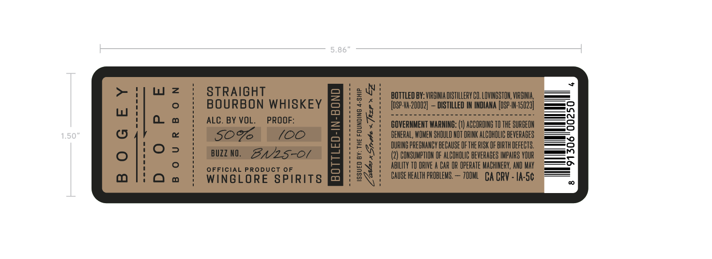
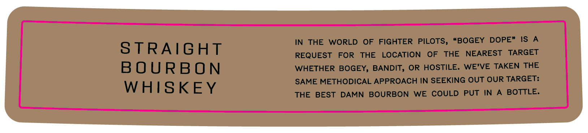

# TTB COLA Label Images - TTBID 26134001000750

**Brand Name:** WINGLORE SPIRITS

**Fanciful Name:** BOGEY DOPE BOURBON

**Issue Date:** 05/20/2026

**Origin Code:** 05

**Product Class/Type:** 101

**Source:** [TTB Public COLA Registry](https://ttbonline.gov/colasonline/viewColaDetails.do?action=publicFormDisplay&ttbid=26134001000750)

## Label Images

### Label 1

### Label 2

## Extracted Label Text

*Text extracted via OCR - may contain errors*

### Label 1

8 6
L
STRAIGHT
04
BOTTLED BY: VIRGIHIA DISTILLERY CO, LOVIHESTON, VIRGIIA
L
BOURBON WHISKEY
3
[oSp-Va-20002]
DISTILLED IN INDIANA [DSP-IH:15029]
ALC. BY VOL.
PROOF:
@
BOVERNMENT WARNING:
ACCORDING TO thE SURGEOH
1.50"
6
50
(00
GEHERAL, WOMEM SHOULD MOT DRINK ALCOHOLIC BEVERABES
I
4
DURING PREGHANCY BECAUSE OF THE RISK OF BIRTH DEFECTS,
BUZZ NO.
BNz5-0l
6
CONSUHPTIOH OF ALCOHOLIC bEveRABES IMPAIRS VOUR
ABILITY T0 DRIVE
BAR OR OpeRATE MACHINERY, AND Hay
0
WinGiGRPucs Pfrits
1
Cause health pRObLEMS.
700ML   CA CRV - Ia-5c

### Label 2

IN
THE
WORLD
OF
FIGHTER
PILOTS,
#BOGEY
DOPE"
IS
A
S TRAIGHT
REQUEST
FOR
THE
LOCATION
OF
THE
NEAREST
TARGET
B OURBON
WHETHER BOGEY, BANDIT, OR
HOSTILE. WE'VE TAKEN THE
SAME METHODICAL APPROACH IN SEEKING OUT OUR TARGET:
WHISKEY
THE
BEST
DAMN
BOURBON
WE
COULD
PUT
IN
BOTTLE.
