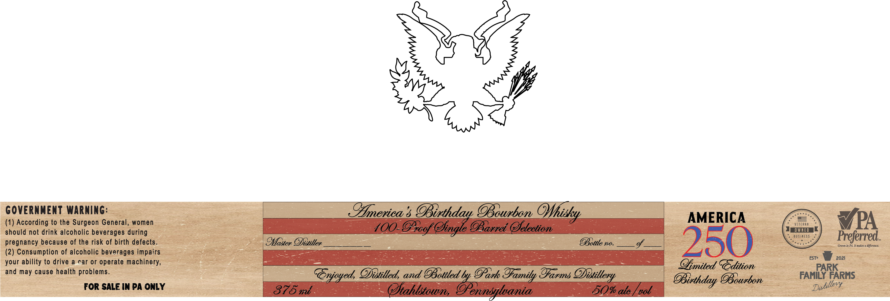

# TTB COLA Label Images - TTBID 26134001000840

**Brand Name:** AMERICA'S BIRTHDAY

**Issue Date:** 05/22/2026

**Origin Code:** 39

**Product Class/Type:** 141

**Source:** [TTB Public COLA Registry](https://ttbonline.gov/colasonline/viewColaDetails.do?action=publicFormDisplay&ttbid=26134001000840)

## Label Images

### Label 1

## Extracted Label Text

*Text extracted via OCR - may contain errors*

### Label 1

GovERnMENT Warning:
Pmerica & OBtthday OBowxbon
AMERICA
(1) According to the Surgeon General, women
VETERAm
VPA
should not drink alcoholic beverages during
100-@ogf Ofigle @Barrei Ofetection
OWMED
B $
HESS
Preferred_
pregnancy because of the risk of birth defects.
Sfaster Oibtiller_
OBottle no.
250
Grown in PL It makes a difference
(2) Consumption of alcoholic beverages impairs
ESTe
2021
your ability to drive
a car or operate machinery,
Ofmited  Gdition
and may cause health problems
Gnjoyed Ofitilleda and OBottled by OPark
Zfarms
FAMEARKRHS
OBourbon
For SALE In PA ONLY
875
(tahlstowm;
ernnsilyania
50% atc ,
gol
OHhisky
@famity =
Oitilleryy
OBirthday
Dulillerx
mUl
