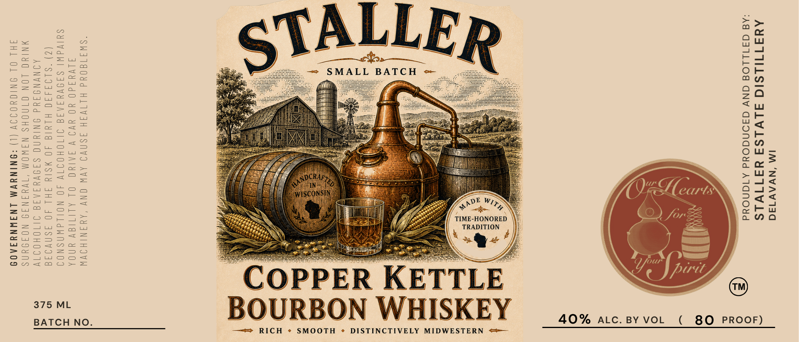

# TTB COLA Label Images - TTBID 26134001000986

**Brand Name:** STALLER

**Fanciful Name:** COPPER KETTLE BOURBON

**Issue Date:** 06/01/2026

**Origin Code:** 48

**Product Class/Type:** 141

**Source:** [TTB Public COLA Registry](https://ttbonline.gov/colasonline/viewColaDetails.do?action=publicFormDisplay&ttbid=26134001000986)

## Label Images

### Label 1

## Extracted Label Text

*Text extracted via OCR - may contain errors*

### Label 1

IM ‘NVAV134d

AMATULSIC ALVLSA YATIVLS
*A@ GA1LLO8 GNV GaONdOud ATGNOdd

s

»Q@-

ER KETTLE

TIME-HONORED
TRADITION

\%&

—=- SMALL BATCH +

ON

“SWI1808d HITVSH ASNVI AVW ONY “AYINIHOVW
A1VYdd0 YO YVI VY FAIUC OL ALITIGY UNDA
SUlVdWI SFOVYIATI JITOHOITVY 40 NOILdIWASNOI
(2) “S109440 HLYId 40 WSIY FHL 40 3SNV94E
AINYNS ANd INIYNG SANVYIATI JIIOHOITV
WNIYC LON CTNOHS NIWOM ‘1VYINII NOIIUNS
JHL OL ONIGYODIY (1) *ONINYVM LNIWNYFAOS

P

Cop
BOUR

D

375 ML

ON WHISKEY

—= RICH * SMOOTH ¢ DISTINCTIVELY MIDWESTERN =>—

8O PROOF)

(

40% AILc. BY VOL

BATCH NO.
