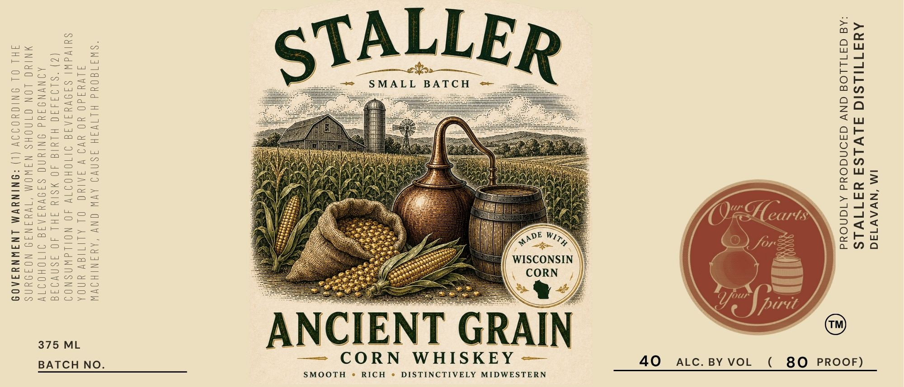

# TTB COLA Label Images - TTBID 26135001000001

**Brand Name:** STALLER

**Fanciful Name:** ANCIENT GRAIN CORN WHISKEY

**Issue Date:** 05/20/2026

**Origin Code:** 48

**Product Class/Type:** 143

**Source:** [TTB Public COLA Registry](https://ttbonline.gov/colasonline/viewColaDetails.do?action=publicFormDisplay&ttbid=26135001000001)

## Label Images

### Label 1

## Extracted Label Text

*Text extracted via OCR - may contain errors*

### Label 1

IM ‘NVAV14d

AYMATIILSIO ALVLSA YATIVLS
*A@ GA1LLO8 GNV Ga9NdOud ATaNOdd

WISCONSIN

se SMALL BATCH +

“SHITGO0Ud HLIVIH JSNVI AVW ONY 'AYINIHOVW
ALVddd0 YO YVI Y FALUO OL ALITIGY UNDA
SUlVdW! SANVYIATT BTOHOITVY 40 NOILdIWASNOI
(Z) “SLO4440 HLYIG 40 WSIY FHL 40 3SNVO9E
AINYNS ANd INIUNG SINVAAATI JIIOHOITV
WNIYO LON CINGHS NIWOM ‘IVYINII NOFIUNS
FHL OL ONIGHODOY (1) S9NINUVM LNAIWNYFAOS

ENT

,

C

— CORN WHISKEY =

AN

375 ML

8O PROOF)

(

40 Lc. BY VOL

BATCH NO.

SMOOTH © RICH « DISTINCTIVELY MIDWESTERN
