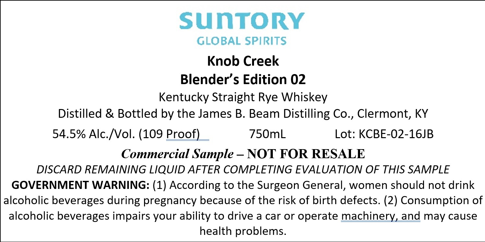

# TTB COLA Label Images - TTBID 26135001000060

**Brand Name:** KNOB CREEK

**Issue Date:** 05/20/2026

**Origin Code:** 22

**Product Class/Type:** 102

**Source:** [TTB Public COLA Registry](https://ttbonline.gov/colasonline/viewColaDetails.do?action=publicFormDisplay&ttbid=26135001000060)

## Label Images

### Back Label

## Extracted Label Text

*Text extracted via OCR - may contain errors*

**Detected Proof:** 109

### Back Label

SUNTORY

GLOBAL SPIRITS

Knob Creek

Blender’s Edition 02

Kentucky Straight Rye Whiskey

Distilled & Bottled by the James B. Beam Distilling Co., Clermont, KY

54.5% Alc./Vol. (109 Proof)

750mL

Lot: KCBE-02-16JB

Commercial Sample -NOT FOR RESALE

DISCARD REMAINING LIQUID AFTER COMPLETING EVALUATION OF THIS SAMPLE

GOVERNMENT WARNING: (1) According to the Surgeon General, women should not drink

alcoholic beverages during pregnancy because of the risk of birth defects. (2) Consumption of

alcoholic beverages impairs your ability to drive a car or operate machinery, and may cause

health problems.
