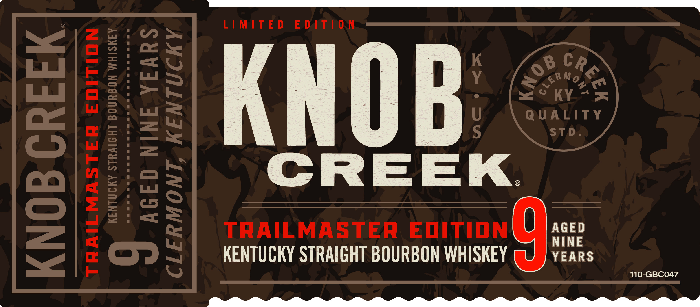
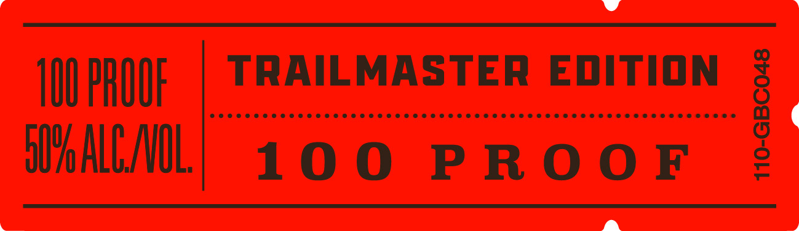
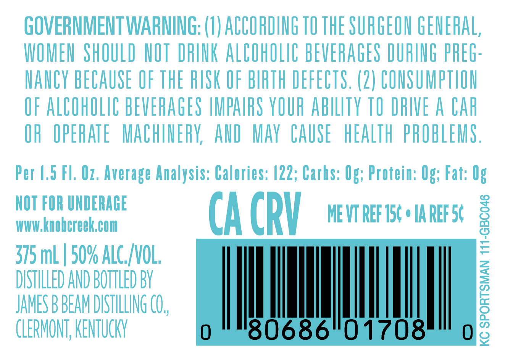

# TTB COLA Label Images - TTBID 26135001000074

**Brand Name:** KNOB CREEK

**Issue Date:** 05/20/2026

**Origin Code:** 22

**Product Class/Type:** 101

**Source:** [TTB Public COLA Registry](https://ttbonline.gov/colasonline/viewColaDetails.do?action=publicFormDisplay&ttbid=26135001000074)

## Label Images

### Label 1

### Label 2

### Label 3

### Label 4

## Extracted Label Text

*Text extracted via OCR - may contain errors*

*1 image(s) excluded: text did not meet readability threshold*

**Detected Proof:** 100

### Label 1

LIMITED EDATION

KNOB

CREEK.

TRAILMASTER EDITION

AGED

KENTUCKY STRAIGHT BOURBON WHISKEY

YEARS

g

110-GBC047

### Label 2

wv

100 PROOE

TRAILMASTER EDITION

3

Co voc reser crseccesecese sees esses eesecesseeeeseesesesseseeseD

ie

WO ALLANOL

100 PROOF

a

=

### Label 3

GOVERNMENT WARNING: (8) ACCORDING TO THE SURGEON GENERAL;
WOMEU ShOULD NOT DRINK ALCOhOLIC BEVERAGES DURIUG PREG-
ManCv BECAUSE OF THE RUSK OF BIRTH DEFECTS. (2) CONSUMPTHON
OF ALCOhOLIC BEVERAGES IMPAIRS YOUR abiLTY TO DRIVE A CAr
OR  OPERATE   MACHUERK AnD  Mav  CAUSE  hEALTh  PROBLEMS ,
Per 4.5 Fl: Oz. Average Analysis: Calories: |22; Carbs: Og; Protein: Og; Fat: Og
NOT FOR UNDERAGE
WWW knobcreekcom
CA CRV
ME VT REF 156
IA REF 56
1
375 mL | 50% ALC_  NOL;
DISTILLED AND BOTTLED BV
JAMES B BEAM DUSTILLING CO,
1
CLERMONT; KENTUCKN
80686"01708
2
