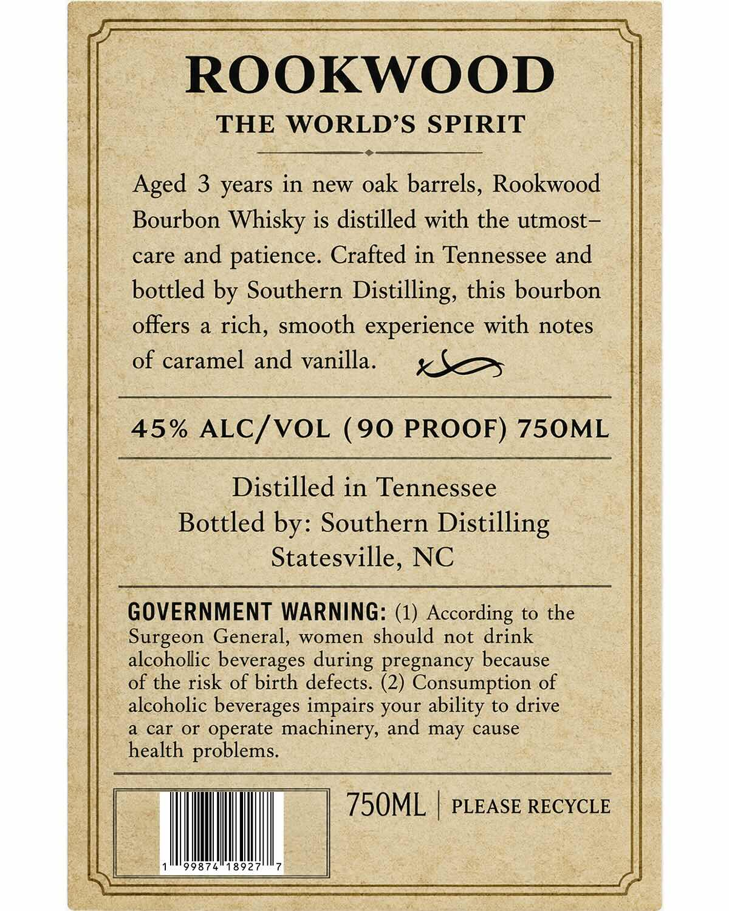
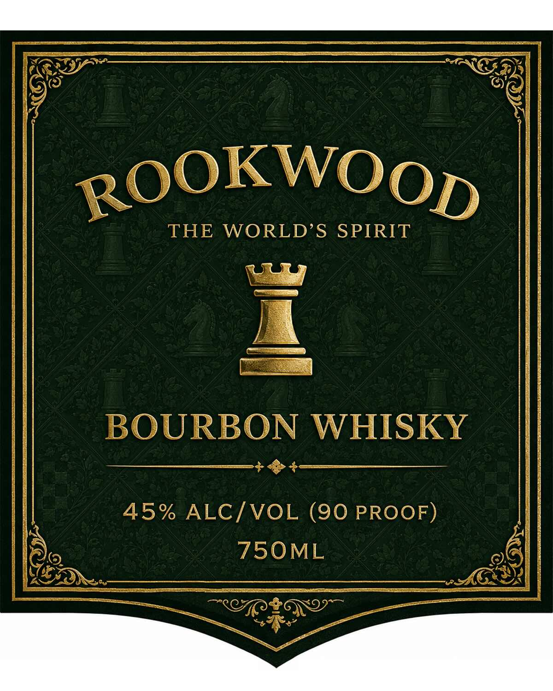

# TTB COLA Label Images - TTBID 26135001000110

**Brand Name:** ROOKWOOD

**Issue Date:** 05/22/2026

**Origin Code:** 35

**Product Class/Type:** 141

**Source:** [TTB Public COLA Registry](https://ttbonline.gov/colasonline/viewColaDetails.do?action=publicFormDisplay&ttbid=26135001000110)

## Label Images

### Back Label

### Front Label

## Extracted Label Text

*Text extracted via OCR - may contain errors*

**Detected Proof:** 90
**Detected Age:** 3 Years

### Back Label

ROOKWOOD
THE
WORLDS SPIRIT
Aged 3 years in new oak barrels, Rookwood
Bourbon Whisky is distilled with the utmost _
care and
patience. Crafted in Tennessee and
bottled by Southern Distilling, this bourbon
offers
a
rich, smooth experience with notes
of caramel and vanilla_
45% ALC/VOL
(90 PROOF) 750ML
Distilled in Tennessee
Bottled
Southern Distilling
Statesville, NC
GOVERNMENT WARNING: (1) According to the
Surgeon General, women should not drink
alcohollic beverages during pregnancy because
of the risk of birth defects. (2) Consumption of
alcoholic beverages impairs your ability to drive
a
car Or operate
machinery, and may cause
health problems.
750ML
PLEASE RECYCLE
99874"18927
by:

### Front Label

ROOKWOOD
THE
WORLD'S SPIRIT
4
BOURBON WHISKY
45% ALCIVOL (90 PROOF)
750ML
