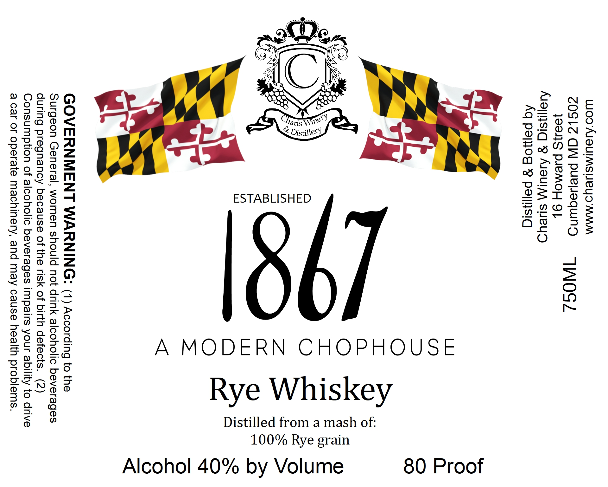

# TTB COLA Label Images - TTBID 26135001000131

**Brand Name:** CHARIS WINERY & DISTILLERY

**Fanciful Name:** 1867 A MODERN CHOPHOUSE

**Issue Date:** 05/21/2026

**Origin Code:** 25

**Product Class/Type:** 142

**Source:** [TTB Public COLA Registry](https://ttbonline.gov/colasonline/viewColaDetails.do?action=publicFormDisplay&ttbid=26135001000131)

## Label Images

### Label 1

## Extracted Label Text

*Text extracted via OCR - may contain errors*

**Detected Proof:** 80

### Label 1

Wwoo'AISUIMSHeUS MMM
ZOSLZ GW PueeqUND §=4\WIQG/
}804]S PJEMOH Q]
Aaiysiq g Aeul\y sueyd
Aq pamog 8 paisiq

iskey

Distilled from a mash of:

867

A MODERN CHOPHOUSE

Rye Wh

GOVERNMENT WARNING: (1) According to the
Surgeon General, women should not drink alcoholic beverages
during pregnancy because of the risk of birth defects. (2)
Consumption of alcoholic beverages impairs your ability to drive
a car or operate machinery, and may cause health problems.

Rye grain

100%

Alcohol 40% by Volume

80 Proof
