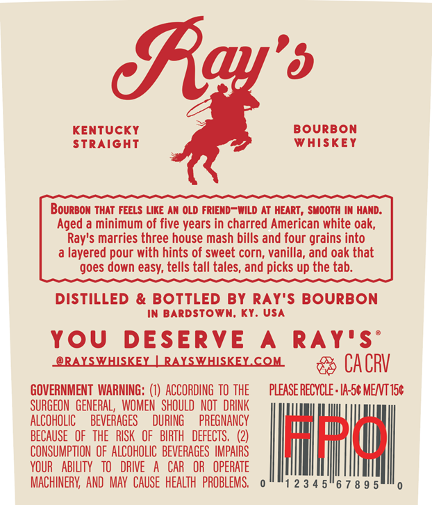
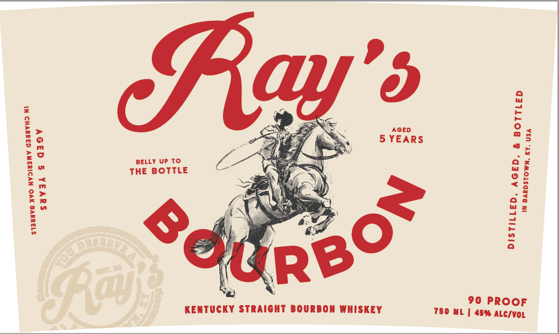

# TTB COLA Label Images - TTBID 26135001000156

**Brand Name:** RAY'S BOURBON

**Issue Date:** 06/16/2026

**Origin Code:** 22

**Product Class/Type:** 101

**Source:** [TTB Public COLA Registry](https://ttbonline.gov/colasonline/viewColaDetails.do?action=publicFormDisplay&ttbid=26135001000156)

## Label Images

### Back Label

### Label 1

## Extracted Label Text

*Text extracted via OCR - may contain errors*

**Detected Proof:** 90

### Back Label

Ea'6
KENTUCKY
Bourbon
StraiGHT
Whiskey
Bourbon THaT FEELS Like AN OLD FRIEND-Wild AT HEART , SMoOTH IN HAND:
Aged a minimum of five years in charred American white oak;
Ray's marries three house mash bills and four grains into
layered pour with hints of sweet corn, vanilla, and oak that
goes down easy; tells tall tales, and picks up the tab:
DistiLLEd & BOTTLED By RAY'S bourbon
In BardsTown; Ky: USA
You
DESERVE
A
RAY'S
@RALSWHSKEX LRAXSWHSKEL CQH
CA CRV
GOVERNMENT WARNING: (€) ACCORDING TO THE
PLEASE RECYCLE : IA-5c MENT 156
SURGEON  GENERAL,  WOMEN  SHOULD   NOT   DRINK
ALCOHOLIC
BEVERAGES
DURING
PREGNANCY
BECAUSE   OF   THE  RISK   OF   BIRTH
DEFECTS ,
LuH
CONSUMPTION  OF ALCOHOLIC   BEVERAGES  IMPAIRS
VOUR
AbiLTY   TO
DRIVE
CAR   OR
OPERATE
MACHINERK;  AND  MAY   CAUSE   HEALTH   PROBLEMS,
2 3 4 5"6 7 8 9 5

### Label 1

BELLY UP TO
THE BOTTLE

va XO NYDIUANY GAMBVHO ME
suvak § G39V

1am

KENTUCKY STRAIGHT BOURBON WHISKEY

LED

DISTILLED, AGED, & Bott
IN BARDSTOWN, KY. Usa

90 PROOF
750 ML | 45% ALc/voL
