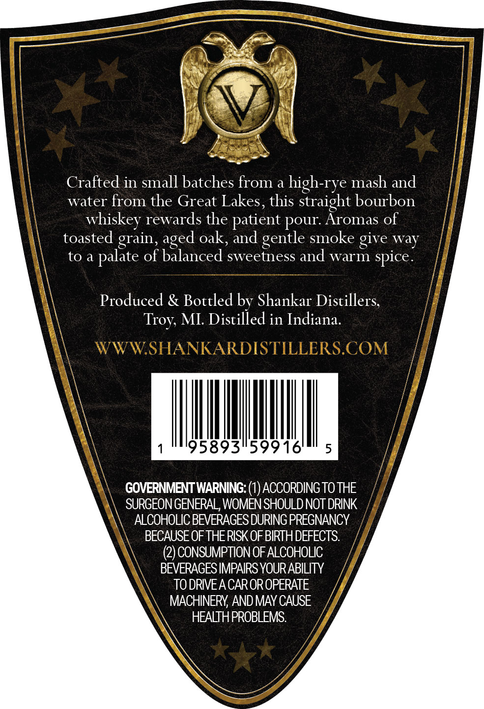
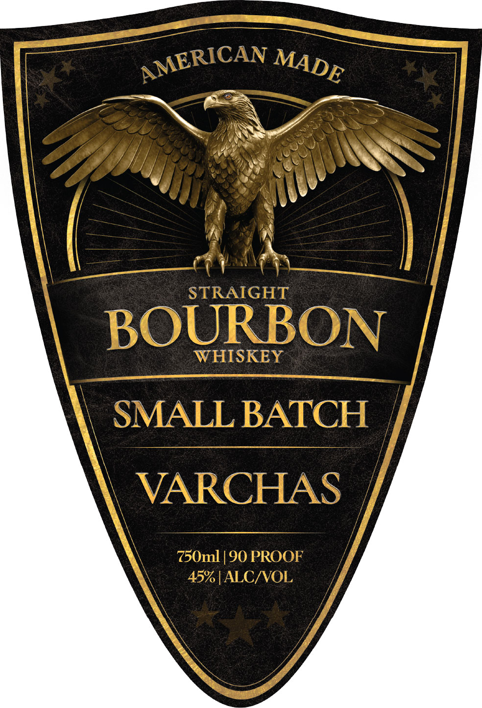

# TTB COLA Label Images - TTBID 26135001000186

**Brand Name:** VARCHAS

**Fanciful Name:** SMALL BATCH STRAIGHT BOURBON WHISKEY

**Issue Date:** 05/20/2026

**Origin Code:** 06

**Product Class/Type:** 101

**Source:** [TTB Public COLA Registry](https://ttbonline.gov/colasonline/viewColaDetails.do?action=publicFormDisplay&ttbid=26135001000186)

## Label Images

### Back Label

### Front Label

## Extracted Label Text

*Text extracted via OCR - may contain errors*

**Detected Proof:** 90

### Back Label

Crafted in small batches from a
high-rye mash and
water from the Great Lakes, this straight bourbon
whiskey rewards the patient pour: Aromas of
toasted grain,
oak; and gentle smoke give way
to a
of balanced sweetness and warm spice
Produced & Bottled by Shankar Distillers;
MI: Distilled in Indiana.
WWWSHANKARDISTILLERS.COM
95893159916'
5
GOVERNMENT WARNING:
ACCORDING TO THE
SURGEON GENERAL, WOMEN SHOULD NOT DRINK
ALCOHOLIC BEVERAGES DURING PREGNANCY
BECAUSE OF THERISK OFBIRTH DEFECTS:
(2) CONSUMPTION OF ALCOHOLIC
BEVERAGES IMPAIRS YOURABILITY
TO DRIVEA CAROR OPERATE
MACHINERY; AND MAY CAUSE
HEALTHPROBLEMS:
aged
palate
Troy;

### Front Label

STRAIGHT
BOURBON
WHISKEY
SMALL BATCH
VARCHAS
750ml | 90 PROOF
45% [ALCIVOL
AMERICAN
MADE
