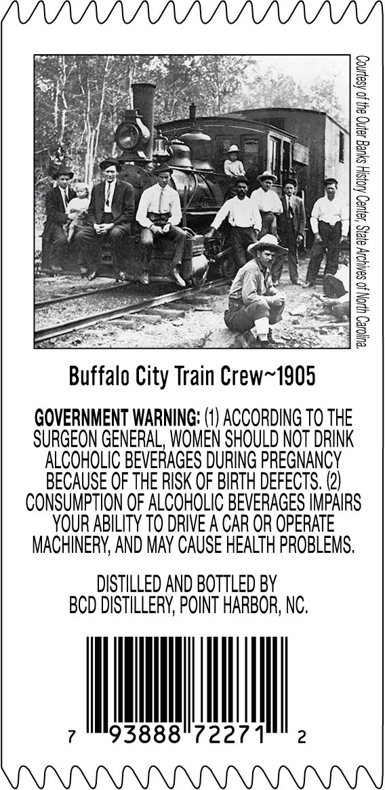
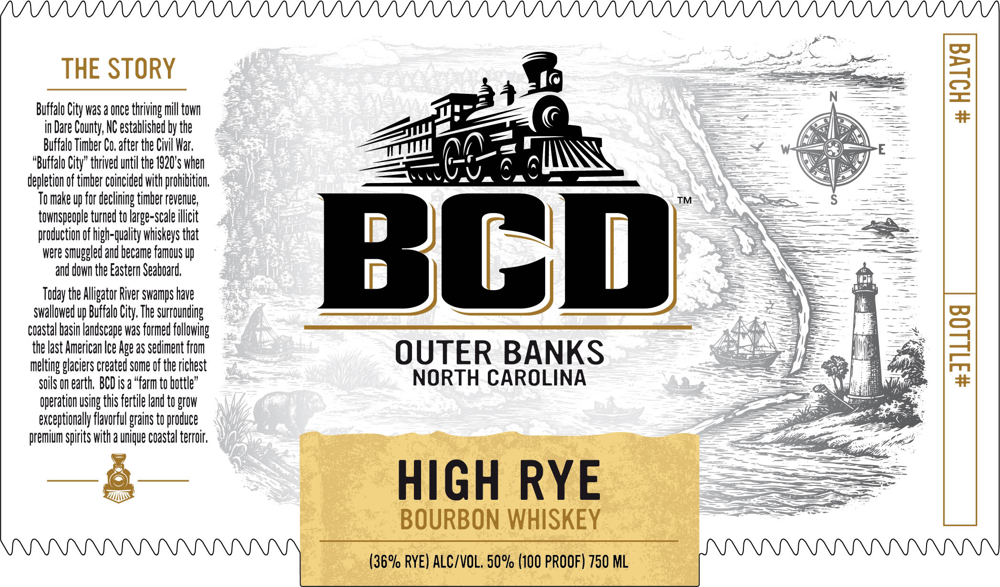

# TTB COLA Label Images - TTBID 26135001000195

**Brand Name:** BCD

**Issue Date:** 05/21/2026

**Origin Code:** 35

**Product Class/Type:** 141

**Source:** [TTB Public COLA Registry](https://ttbonline.gov/colasonline/viewColaDetails.do?action=publicFormDisplay&ttbid=26135001000195)

## Label Images

### Back Label

### Front Label

## Extracted Label Text

*Text extracted via OCR - may contain errors*

**Detected Proof:** 100

### Back Label

Buffalo City Train Crew~1905
GOVERNMENT WARNING: (1) ACCORDING 70 THE
SURGEON GENERAL, WOMEN SHOULD NOT DRINK

ALCOHOLIC BEVERAGES DURING PREGNANCY
BECAUSE OF THE RISK OF BIRTH DEFECTS. (2)
CONSUMPTION OF ALCOHOLIC BEVERAGES IMPAIRS

YOUR ABILITY TO DRIVE A CAR OR OPERATE

MACHINERY, AND MAY CAUSE HEALTH PROBLEMS.

DISTILLED AND BOTTLED BY
BCD DISTILLERY, POINT HARBOR, NC.

i lear

7 II 7227
PP PPPPPPP PPA

### Front Label

THE STORY
3
Buffalo City was a Once thriving mill town
#
in Dare County; NC established by the
Buffalo Timber Co, after the Civil War;
"Buffalo City" thrived until the 1920's When
depletion of timber coincided with prohibition;
To make up for declining timber revenue;
townspeople turned to large-scale illicit
Mwiesmghoaunianeianus ua
Bc)
and down the Eastern Seaboard;
Today the Alligator River swamps have
swallowed up Buffalo City The surrounding
coastal basin landscape waS formed following
the last American Ice Age aS sediment from
OUTER BANKS
8
melting glaciers created some of the richest
soils On earth;  BCD is a "farm to bottle"
NORTH CAROLINA
operation uSing this fertile land to grow
exceptionally flavorful grains to produce
premium Spirits with a unique coastal terroir;
HIGH RYE
BOURBON WHISKEY
(36% RYE) ALC/VOL, 5o% (100 PROOF) 750 ML
