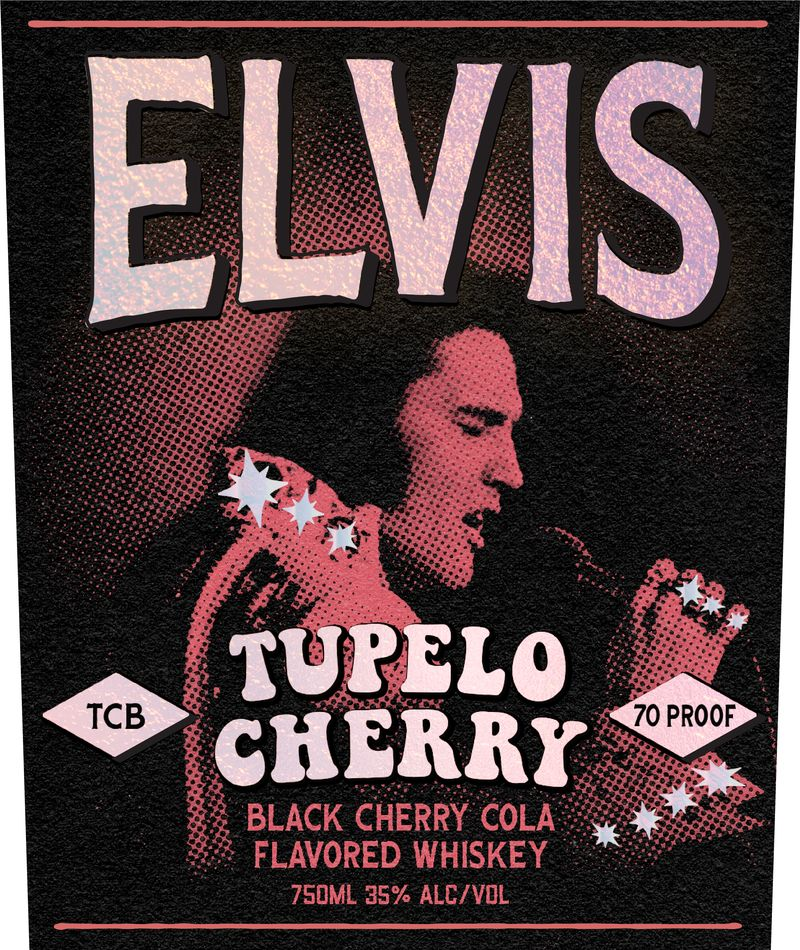
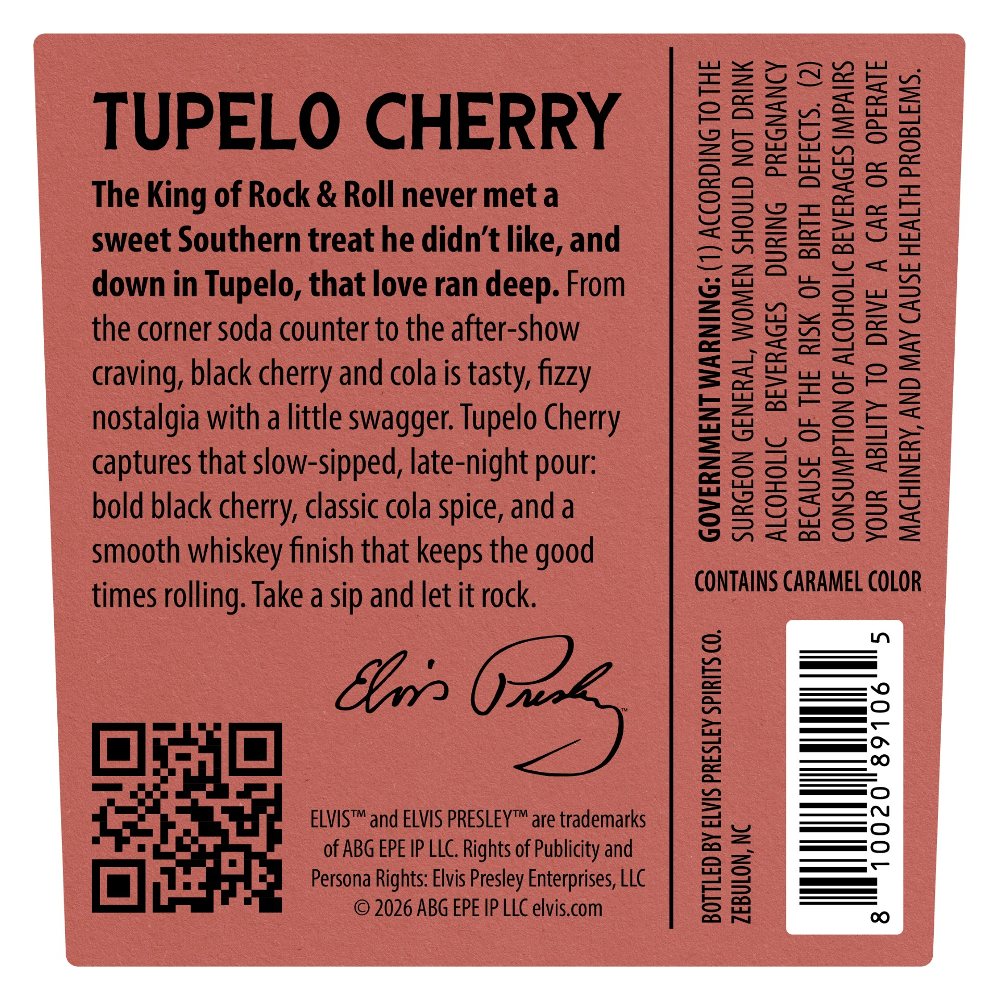

# TTB COLA Label Images - TTBID 26135001000206

**Brand Name:** ELVIS

**Fanciful Name:** TUPELO CHERRY

**Issue Date:** 07/09/2026

**Origin Code:** 35

**Product Class/Type:** 149

**Source:** [TTB Public COLA Registry](https://ttbonline.gov/colasonline/viewColaDetails.do?action=publicFormDisplay&ttbid=26135001000206)

## Label Images

### Label 1

### Label 2

### Label 3

## Extracted Label Text

*Text extracted via OCR - may contain errors*

*1 image(s) excluded: text did not meet readability threshold*

**Detected Proof:** 140

### Label 1

ELVIS
TUPELO
TCB
70 PROOF
CHERRY
BLACK CHERRY COLA
FLAVORED WHISKEY
750ML 35% ALC/ VOL

### Label 3

TUPELO CHERRY

The King of Rock & Roll never met a
sweet Southern treat he didn’t like, and
down in Tupelo, that love ran deep. From
the corner soda counter to the after-show
craving, black cherry and cola is tasty, fizzy
nostalgia with a little swagger. Tupelo Cherry
captures that slow-sipped, late-night pour:
bold black cherry, classic cola spice, anda
smooth whiskey finish that keeps the good
times rolling. Take a sip and let it rock.

URGEON GENERAL, WOMEN SHOULD NOT DRINK
LCOHOLIC ~BEVERAGES DURING PREGNANCY
ECAUSE OF THE RISK OF BIRTH DEFECTS. (2)
ONSUMPTION OF ALCOHOLIC BEVERAGES IMPAIRS
OUR ABILITY TO DRIVE A CAR OR OPERATE
MACHINERY, AND MAY CAUSE HEALTH PROBLEMS.

Lu
ke
—
f=)
=
is)
=
cS
(as
fen)
we)
YU
—
=
oS
=
=
ce
=
=
—
=
htt
=
=
ce
had
—
=)
iS]

5
A
B
C
Y

a
(—)
=
=
=
n”
oO
=
E—)
=
=
mm
em
om
(=)
h—4
(—)
i)

ELVIS™ and ELVIS PRESLEY™ are trademarks
of ABG EPE IP LLC. Rights of Publicity and
Persona Rights: Elvis Presley Enterprises, LLC
© 2026 ABG EPE IP LLC elvis.com

BOTTLED BY ELVIS PRESLEY SPIRITS CO.

ZEBULON, NC
