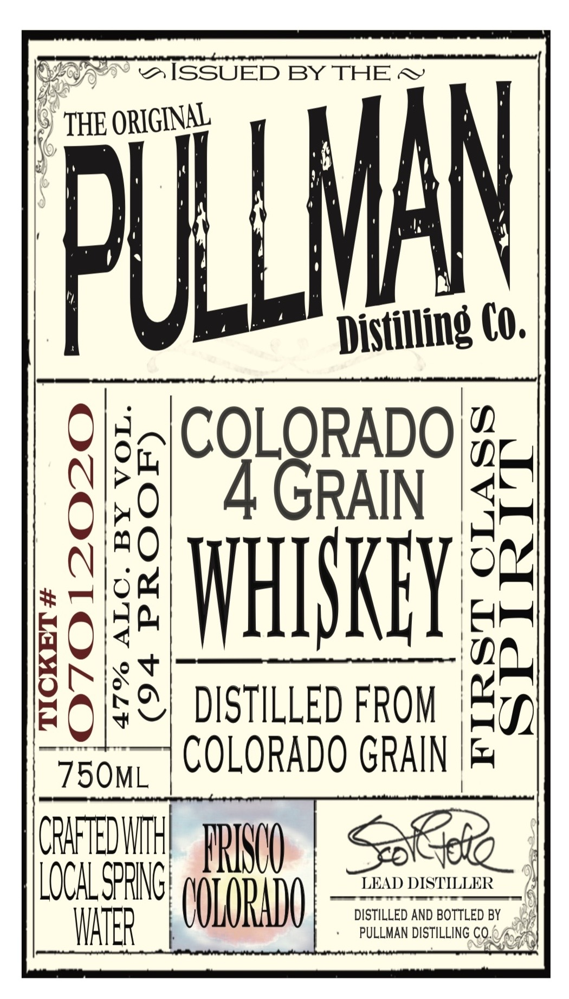
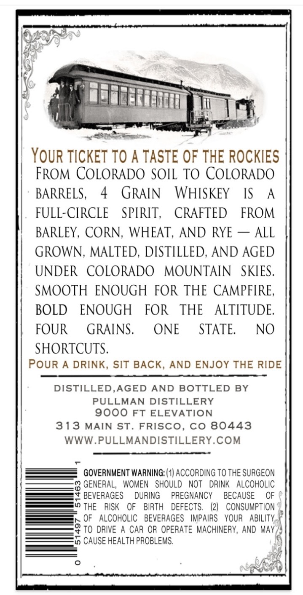

# TTB COLA Label Images - TTBID 26135001000216

**Brand Name:** THE PULLMAN DISTILLING CO.

**Fanciful Name:** COLORADO 4 GRAIN WHISKEY

**Issue Date:** 05/20/2026

**Origin Code:** 13

**Product Class/Type:** 140

**Source:** [TTB Public COLA Registry](https://ttbonline.gov/colasonline/viewColaDetails.do?action=publicFormDisplay&ttbid=26135001000216)

## Label Images

### Label 1

### Label 2

## Extracted Label Text

*Text extracted via OCR - may contain errors*

### Label 1

ISSUED BY THE
THE ORIGINAL
MAN
Dislling Co.
8
COLORADO|
5
1
4 GRAIN
;
1
1
8
IHISKFY
DISTILLED FROM
1
1
COLORADO CRAIN
75OML
CPAFTEDWH
IRIOO
LOCAL SPFNCH
LEAD DISTLLER
OOIORHDO
DISTILLED AND BOTTLED BY
WATER
PULLMAN DISTILLING CO,
U

### Label 2

Oe

Pe

i

IK

San

4

if

es (m

| YOUR TICKET TO A TASTE OF THE ROCKIES

FROM COLORADO SOIL TO COLORADO

BARRELS

4 GRAIN WHISKEY

IS A

FULL-CIRCLE SPIRIT, CRAFTED FROM

BARLEY, CORN, WHEAT, AND RYE — ALL

GROWN, MALTED, DISTILLED, AND AGED

UNDER COLORADO MOUNTAIN SKIES

SMOOTH ENOUGH FOR THE CAMPFIRE

BOLD ENOUGH FOR THE ALTITUDE

FOUR GRAINS

ONE

STATE

NO

SHORTCUTS

POUR A DRINK, SIT BACK, AND ENJOY THE RIDE

DISTILLED,AGED AND BOTTLED BY

PULLMAN DISTILLERY

9000 FT ELEVATION

313 MAIN ST. FRISCO, CO 80443

WWW.PULLMANDISTILLERY.COM

GOVERNMENT WARNING: (1) ACCORDING TO THE SURGEON

2 GENERAL, WOMEN SHOULD NOT DRINK ALCOHOLIC

BEVERAGES DURING PREGNANCY BECAUSE OF

THE RISK OF BIRTH DEFECTS

(2) CONSUMPTION

OF ALCOHOLIC BEVERAGES IMPAIRS YOUR ABILITY.”

TO DRIVE A CAR OR OPERATE MACHINERY, AND MAY )

to CAUSE HEALTH PROBLEMS.

po
