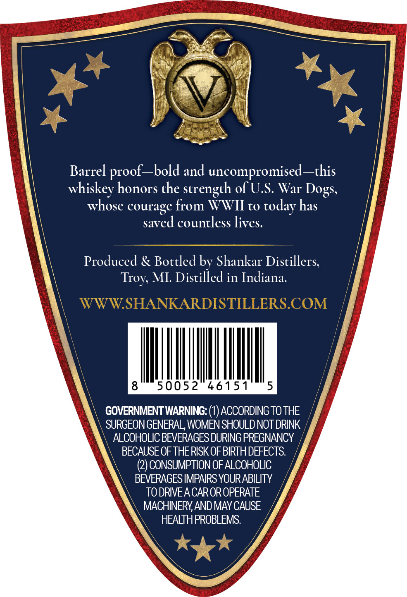
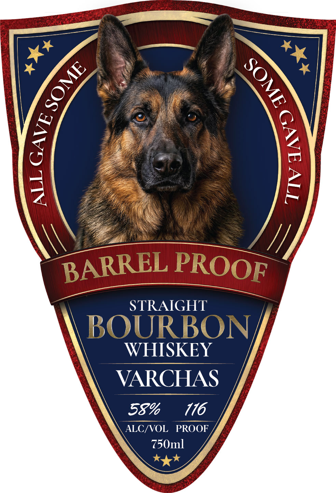

# TTB COLA Label Images - TTBID 26135001000239

**Brand Name:** VARCHAS

**Fanciful Name:** WAR DOG MEMORIAL EDITION BARREL PROOF STRAIGHT BOURBON WHISKEY

**Issue Date:** 05/20/2026

**Origin Code:** 06

**Product Class/Type:** 101

**Source:** [TTB Public COLA Registry](https://ttbonline.gov/colasonline/viewColaDetails.do?action=publicFormDisplay&ttbid=26135001000239)

## Label Images

### Back Label

### Front Label

## Extracted Label Text

*Text extracted via OCR - may contain errors*

**Detected Proof:** 116

### Back Label

Barrel
proof_bold and uncompromised _this
whiskey honors the strength of U.S War
whose courage from WWII to
today has
saved countless lives.
Produced & Bottled by Shankar Distillers;
MI: Distilled in Indiana.
WWWSHANKARDISTILLERS.COM
8
50052
46151
5
GOVERNMENT WARNING:
ACCORDING TO THE
SURGEON GENERAL, WOMEN SHOULD NOT DRINK
ALCOHOLIC BEVERAGES DURING PREGNANCY
BECAUSE OF THERISK OFBIRTH DEFECTS:
(2) CONSUMPTION OF ALCOHOLIC
BEVERAGES IMPAIRS YOURABILITY
TO DRIVEA CAROR OPERATE
MACHINERYAND MAY CAUSE
HEALTHPROBLEMS:
Dogs;
Troy;

### Front Label

STRAIGHT
BOURBON
WHISKEY
VARCHAS
58%
176
ALC/VOL
PROOF
750ml
9
1
{
1
BARREL
PROOF
