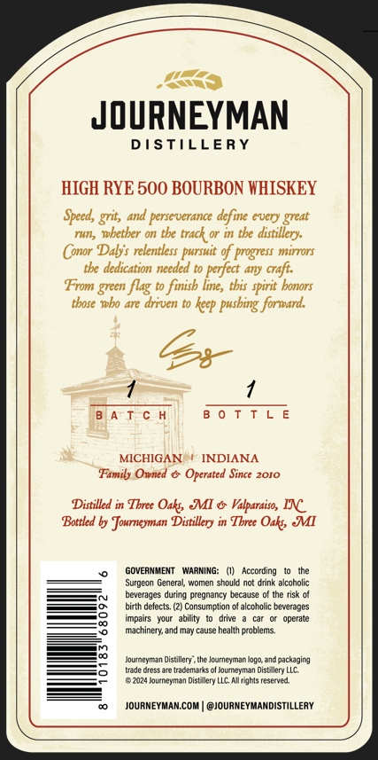
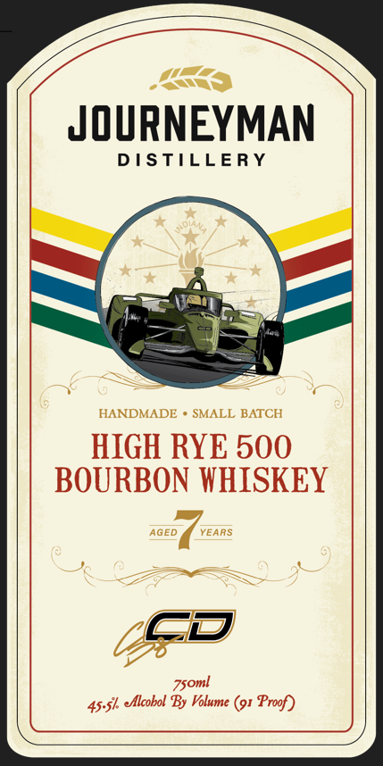

# TTB COLA Label Images - TTBID 26135001000252

**Brand Name:** JOURNEYMAN DISTILLERY

**Fanciful Name:** HIGH RYE 500 BOURBON WHISKEY

**Issue Date:** 06/03/2026

**Origin Code:** 06

**Product Class/Type:** 141

**Source:** [TTB Public COLA Registry](https://ttbonline.gov/colasonline/viewColaDetails.do?action=publicFormDisplay&ttbid=26135001000252)

## Label Images

### Back Label

### Front Label

## Extracted Label Text

*Text extracted via OCR - may contain errors*

**Detected Proof:** 91

### Back Label

JOURNEYMAN
DISTILLERY
HIGH RYE 500 BOURBON WHISKEY
Speed, grit,
ana perse uerance
define every great
run, whether on the track or in tbe
distillery:
onor
Dalys relentless pursuit of progress mirrors
tbe dedication needed to perfect any craft:
From green flag to finisb
tbis spirit bonors
thore Tbo are arrven t0
keep pusbing forward:
B AT € h
8 0 T T L E
MICHIGAN
INDIANA
Family Owned & Operated Since 2010
Distilled in Tbree Oaks &I & Valparaiso, INC
Bottled by Journeyman Distillery in Tbree Oaks; MI
GOVERMMENT
WARNING:
According
Surgewn General women
not drink alcoholic
beverages during pregnancy
nncaisD
the risk
birth delects: (2) Consumpiian
alcoholic beverages
impairs   your   ability
operate
machinery; and maj
cause healin pablenis
Jouineyian Distillery . the Joureyman logo and packajinj
lnjc Olcss
Irac emtanes ol ourneyman Distallery LLC
Liza  durn#vmdi
Dist Ilery LLC
ahis reserved
JOURNEYMANcOM
@JOURNEYMANDISTILLERY
line,
728
choulo

### Front Label

JOURNEYMAN
D I STILLERY
HANDMADE
SMALL BATCH
HIGH RYE 500
BOURBON WHISKEY
AGED
YEARS
zsoml
45.Sk eflcobol By Volume (91 Proof)
