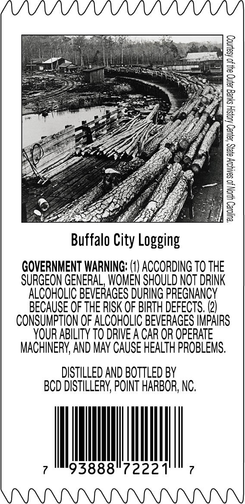
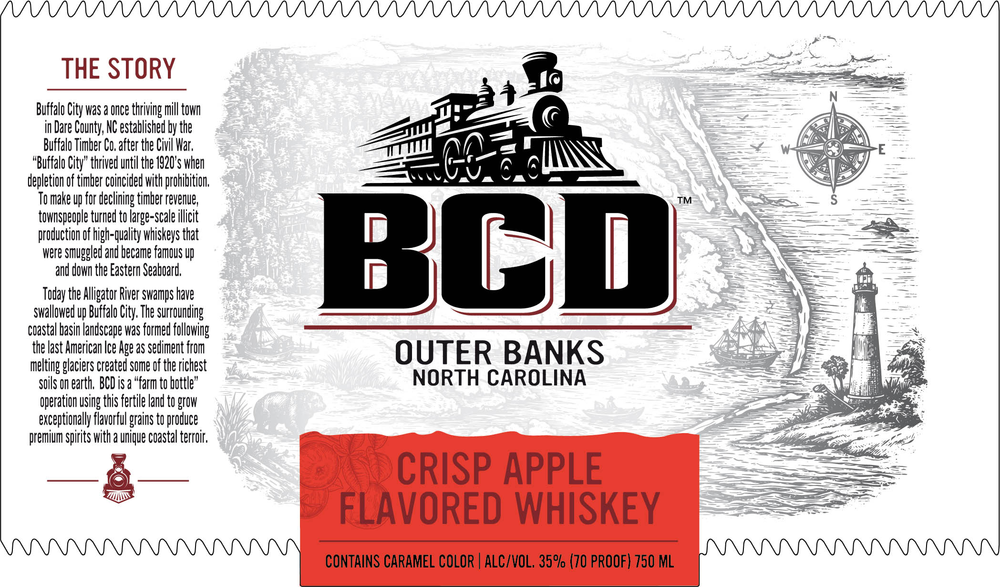

# TTB COLA Label Images - TTBID 26135001000254

**Brand Name:** BCD

**Issue Date:** 05/20/2026

**Origin Code:** 35

**Product Class/Type:** 149

**Source:** [TTB Public COLA Registry](https://ttbonline.gov/colasonline/viewColaDetails.do?action=publicFormDisplay&ttbid=26135001000254)

## Label Images

### Back Label

### Front Label

## Extracted Label Text

*Text extracted via OCR - may contain errors*

**Detected Proof:** 140

### Back Label

Buffalo City Logging

GOVERNMENT WARNING: (1) ACCORDING T0 THE
SURGEON GENERAL, WOMEN SHOULD NOT DRINK
ALCOHOLIC BEVERAGES DURING PREGNANCY
BECAUSE OF THE RISK OF BIRTH DEFECTS. (2)
CONSUMPTION OF ALCOHOLIC BEVERAGES IMPAIRS
YOUR ABILITY TO DRIVE A CAR OR OPERATE
MACHINERY, AND MAY CAUSE HEALTH PROBLEMS.

DISTILLED AND BOTTLED BY
BCD DISTILLERY, POINT HARBOR, NC.

T" 7

7 938887222
DPD PPP PPP PPA

### Front Label

THE STORY

Buffalo City was a once thriving mill town
in Dare County, NC established by the
Buffalo Timber Co, after the Civil War.

“Buffalo City” thrived until the 1920's when
depletion of timber coincided with prohibition,

To make up for declining timber revenue,

townspeople turned to large-scale illicit

production of high-quality whiskeys that
were smuggled and became famous up
and down the Eastern Seaboard,

day the Alligator River swamps have
swallowed up Buffalo City. The surrounding
coastal basin landscape was formed following
the last American Ice Age as sediment from
melting glaciers created some of the richest
soils on earth. BCD is a “farm to hottle”
operation using this fertile and to grow
exceptionally flavorful grains to produce
premium spirits with a unique coastal terroir,

=

OUTER BANKS
NORTH CAROLINA

Ss

Zs

CRISP APPLE
FLAVORED WHISKEY

NII CONTAINS CARAMEL COLOR | ALC/VOL. 35°% (70 PROOF) 750 ML eeeeeeeeeeeneaee
