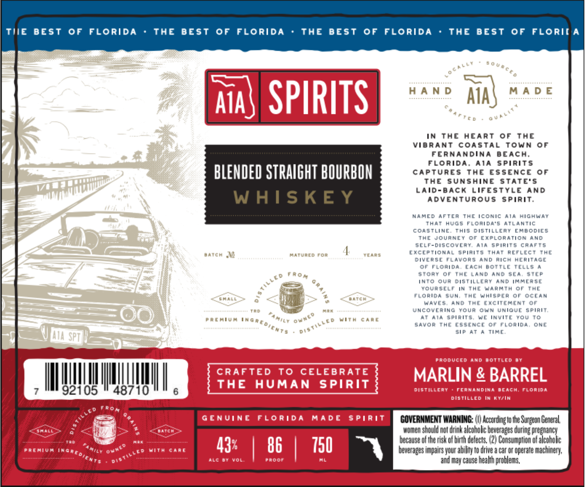

# TTB COLA Label Images - TTBID 26135001000343

**Brand Name:** A1A SPIRITS

**Issue Date:** 05/29/2026

**Origin Code:** 16

**Product Class/Type:** 121

**Source:** [TTB Public COLA Registry](https://ttbonline.gov/colasonline/viewColaDetails.do?action=publicFormDisplay&ttbid=26135001000343)

## Label Images

### Label 1

## Extracted Label Text

*Text extracted via OCR - may contain errors*

### Label 1

TIE
BEST
0F
FLORIdA
THE
BEST
0F
FLORIDA
THE
BEST
0F
FLORIDA
THE
BEST
0F
FLORII A
Aia
SPIRITS
H AN D
Aia'
M A D E
IN
The
HEART
0F
ThE
VIBRANT
COASTAL
ToWN
0F
FERNANDINA
B EACH;
FLORIDA.
ATA
Spirits
BLENDED STRAIGHT BOURBON
capturEs
ThE
ESSENCE
0f
THE
SUNSHINE
STATE'S
LAId-BACk
LIFESTYLE
AND
W AISKE Y
ADVENTUROUS
SPIRIT.
MAMED AFtea TE iconic La
hichuay
That Hugs Floaida'5 ATlamtic
CoAstLiNe
This
cistillery EMBODIES
The Journey
0=
Exploration AND
SELF-Discovest M spirits caaets
batch
Matuacd
FoF
TcARS
EXCEETional spiaits That REFLECT
THE
DiveERSE Favors And aich Heritage
OF FLcaida
EaCh BottlE TelLS
Stoay
0i
TAL Land AND SEA:
STLP
into Qua Distill[ay AnD immlrs[
Yours[Lt in TmI WarMtm
or Thc
Florioa {JN
Jmc wmisrcr Or
Decan
Waves
And Tr[ [*citmini 8
TaD
Hak
Uncoverinc Youa Own Unioue spirit;
RCATL4
MITA
CA#L
At 44 {pirits
We invite YoU T0
Savor The EssencE Cf Floaida, ONE
sir
At
4 Time-
AIA spt
Produccd
And Bottled
0Y
CRAFTED
To
CELEBRATE
MARLIN & BARREL
THE
AUMAN
SPIRIT
92105
48710
6
digtillcay
Fcrwcndina
Bcacm; lorida
DISTIlLeD
Kiin
GEnUiNE
FLoridA
Mad E
5 PiRIT
GOVERMMENT WARMIMG: (V) Accordinzlo Ihe =
Gencral
Mcm
women should not dunk alcoholc beveraees during Hregnancy
Aor
because of the risk od birgh derects: (2) Consumprion od alcoholic
Paimiva
InG
Ilt
Vitm
Caat
43*
86
750
beverages impairs your a1 lity to drive a car or operare machinery;
aLc 0r
Yol
Paddr
AL
and
cause healin problems,
'0 U @ € € 0
0U4 [1 `
0101 [ P
FA0 A
tLLEo
Famiy
OwmId
ingredient?
Distilled
Fom
Tilleo
Surzeon
~Ountd
dibtilled
a{dients
MC
