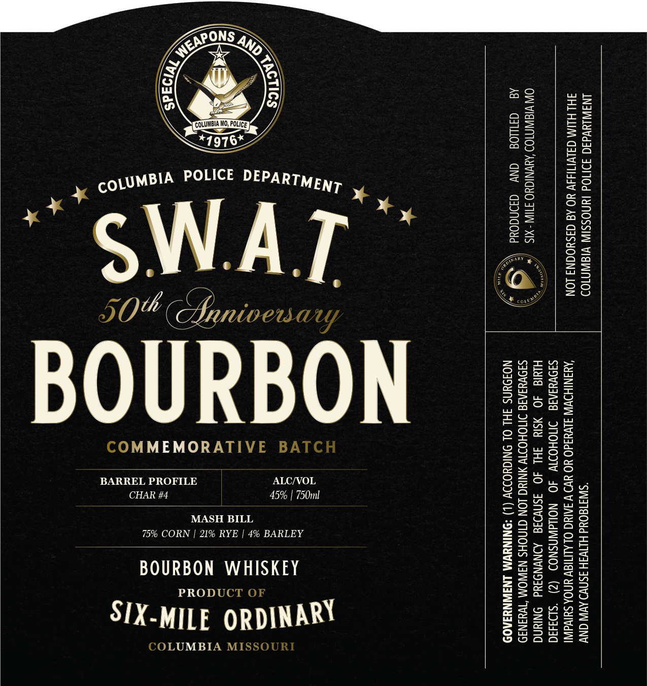

# TTB COLA Label Images - TTBID 26135001000732

**Brand Name:** S.W.A.T. BOURBON

**Issue Date:** 05/27/2026

**Origin Code:** 29

**Product Class/Type:** 141

**Source:** [TTB Public COLA Registry](https://ttbonline.gov/colasonline/viewColaDetails.do?action=publicFormDisplay&ttbid=26135001000732)

## Label Images

### Label 1

## Extracted Label Text

*Text extracted via OCR - may contain errors*

**Detected Proof:** 90

### Label 1

ANIWLYYddd 39110d IYNOSSIN VISIWNI09 “S318 0Ud HITVIH 3SNV) AVIN ONY
JHLHLIM G3LvITIddV YO Ad G3SYOONS LON ‘AUANIHOVIN 3LVYIdO YO UV VIAING OLALITIGY UNOA SUIVdINI
Sa9VUINId IMOHOINV 4O NOMdWASNOD (2) ‘siD4343d
Hluld 4O SIY FHL JO 3SMVOId ADNVNDIYd ONIUNG
SI9VUIAIS NOHO ANING LON GINOHS N3WOM ‘Wa3N39
NOJOYNS FHL OL ONIGHODIV (L) *DNINUVM LNJINNYIAO9

OW VISINM109 ‘ANWNIGUO STIIN -XIS
Ad =Gywod ANY dadNdOud

T¢
T ¢

ALC/VOL
45% | 750ml

a /

COLUMBIA WO, POLICE
*4 97 6*
MASH BILL

75% CORN | 21% RYE | 4% BARLEY
BOURBON WHISKEY
PRODUCT OF

SIX-MILE ORDINARY

COLUMBIA MISSOUR

BARREL PROFILE

COMMEMORATIVE BA
CHAR #4

BOURBON
