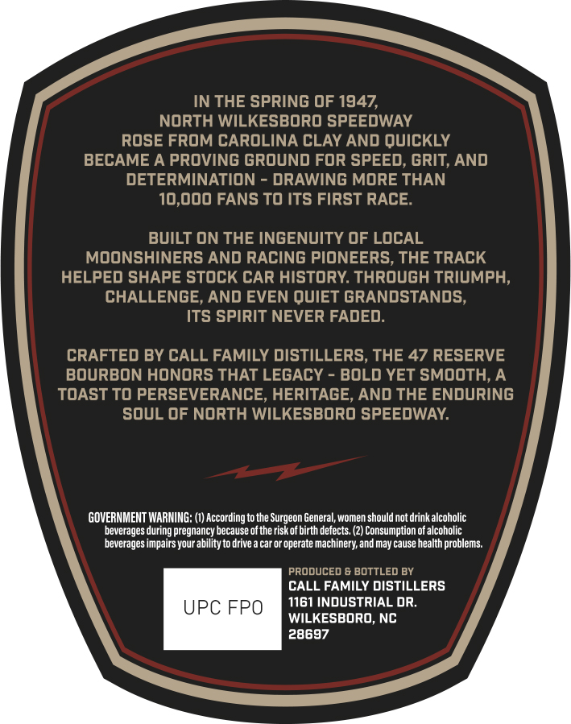
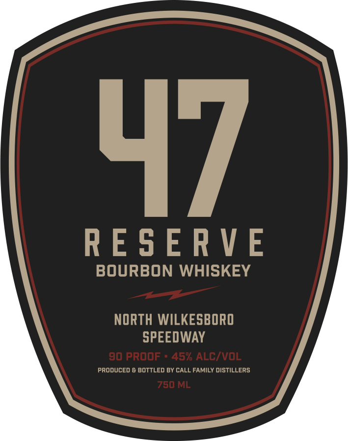

# TTB COLA Label Images - TTBID 26135001000789

**Brand Name:** 47 RESERVE

**Issue Date:** 05/21/2026

**Origin Code:** 35

**Product Class/Type:** 141

**Source:** [TTB Public COLA Registry](https://ttbonline.gov/colasonline/viewColaDetails.do?action=publicFormDisplay&ttbid=26135001000789)

## Label Images

### Back Label

### Front Label

## Extracted Label Text

*Text extracted via OCR - may contain errors*

### Back Label

IN THE SPRING OF 1947,
NORTH WILKESBORO SPEEDWAY
ROSE FROM CAROLINA CLAY AND QUICKLY
BECAME A PROVING GROUND FoR SPEED, GRIT, AND
DETERMINATION
DRAWING MORE THAN
10,000 FANS To ItS FiRST RACE.
BUILT ON THE INGENUITY OF LOCAL
MOONSHINERS AND RACING PIONEERS, THE TRACK
HELPED SHAPE stock CAR history: through TRIUMPH,
CHALLENGE, AND EVEN QUIET GRANDSTANDS,
Its SpiRIT NEVER FADED:
CRAFTED BY CALL FAMILY DISTILLERS, THE 47 RESERVE
BOuRBON HONORS THAT LEGACY
BOLD YET SMOOTH,A
TOAST to PERSEVERANCE, HERITAGE, AND THE ENDURING
soul OF North WILKESBORO SPEEDWAY:
GOVERNMENT WARNING:
According to the Surgeon General; women should not drink alcoholic
beverages during pregnancy because ofthe risk of birth defects. (2) Consumption of alcoholic
beverages impairs your ability to drive
car or operate machinery; and may cause health problems:
produced & BOTTLEd BY
CALL FAMILY DISTILLERS
UPC FPO
1161 INDUSTRIAL dR;
WILKESBORO, NC
28697

### Front Label

4/

RESERVE

BOURBON WHISKEY

NORTH WILKESBORO

SPEEDWAY

PRODUCED & BOTTLED BY CALL FAMILY DISTILLERS
