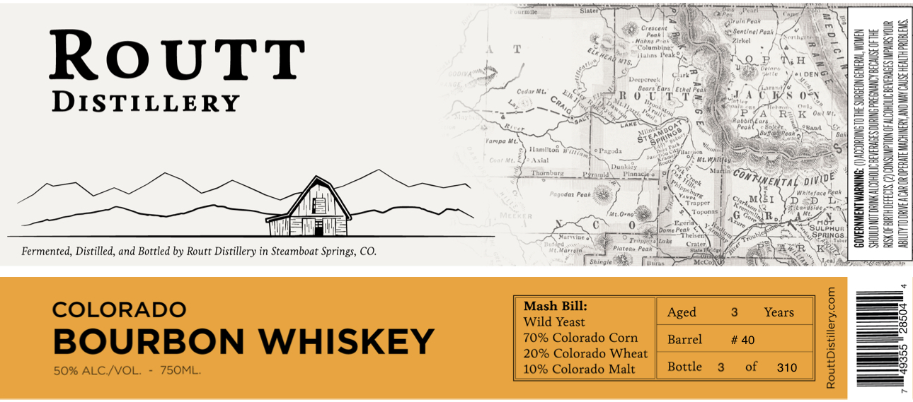

# TTB COLA Label Images - TTBID 26136001000086

**Brand Name:** ROUTT DISTILLERY

**Fanciful Name:** COLORADO BOURBON WHISKEY

**Issue Date:** 05/21/2026

**Origin Code:** 13

**Product Class/Type:** 141

**Source:** [TTB Public COLA Registry](https://ttbonline.gov/colasonline/viewColaDetails.do?action=publicFormDisplay&ttbid=26136001000086)

## Label Images

### Label 1

## Extracted Label Text

*Text extracted via OCR - may contain errors*

**Detected Proof:** 100

### Label 1

Ena
Ciesttut
Santinaleet
Cile
Maan:
7 ckcl
Columbic
RoUTT
J
#TS
Mcline
Fe
 |a
Veeca
DEN
1
DISTILLERY
Crdu Mt
"o
Cundc
t41
54
Ra
Ia" Ou /
I
Reconkeas
Ptur
Sucer
Ot
1e40
(arpo
Spal
Hamliton
Jarud
0t" V
Ain
Mafcpe)
noincue
Exzzetg Dunllmnects
Mattin
1
Paqudon
M{EI
DY"Dece
1
"prcr
' |
Cedlno
Erct Torona
576
H
Durne Feal
Sulphur
ml
InchGn
SPRINCS
Tin
 e
Oenacr
Fermented, Distilled, and Bottled by Routt Distillery in Steamboat Springs, CO.
Maradn
ptatgk Pedk
aEla [
Shingle
Meti
LAcos
COLORADO
Mash Bill:
Aged
Years
Wild Yeast
BOURBON WHISKEY
70% Colorado Corn
Barrel
# 40
1
20% Colorado Wheat
50% ALC /VVOL;
7SOML
10% Colorado Malt
Bottle
of
310
HeAD
Craig
4
M77iraa
Continental
Div(de"
Gut
Gur
