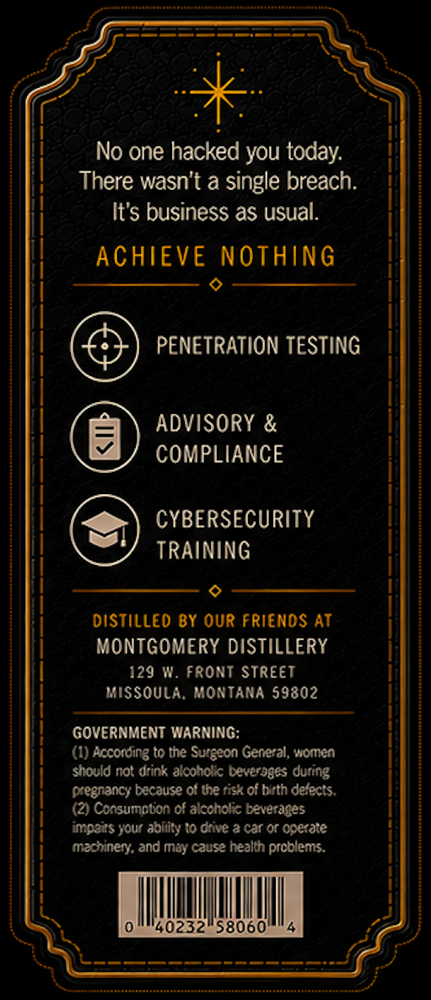
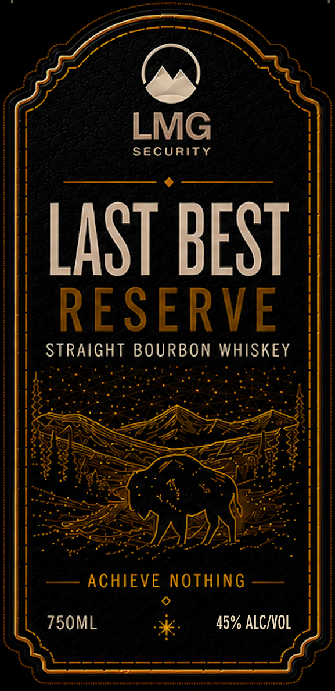

# TTB COLA Label Images - TTBID 26136001000087

**Brand Name:** LAST BEST RESERVE

**Issue Date:** 05/21/2026

**Origin Code:** 30

**Product Class/Type:** 101

**Source:** [TTB Public COLA Registry](https://ttbonline.gov/colasonline/viewColaDetails.do?action=publicFormDisplay&ttbid=26136001000087)

## Label Images

### Back Label

### Front Label

## Extracted Label Text

*Text extracted via OCR - may contain errors*

**Detected Proof:** 90

### Back Label

No one hacked you today:
There wasn't a single breach:
It's business as usual:
ACHIEVE nothing
PENETRATION TESTING
ADVISORY &
COMPLIANCE
CYBERSECURITY
TRAINiNG
distilled By OuR Friends At
MONTGOMERY DISTiLLERY
129 w. front StreeT
Missoula. MonTaNa 59802
GOvERNMENT WaRNiNG;
(1) Accordirg to the Surgeon Gereral, Momen
stould rot drink akotok beverages during
ceerancy tccause 0tte fiek of birth deiec"$.
(2 Ccnsumobon of akcholic beverages
impeirs your abiiity t0 drive & car or ooerate
mainery: and Mily caus: health prcblems.
40232"58060

### Front Label

LMG
SECURity
LaST BEST
RESERVE
STRAIGHT BOURBON WHISKEY
JAFJA
ACHIEVE NothinG
750ML
45% ALCNOL
