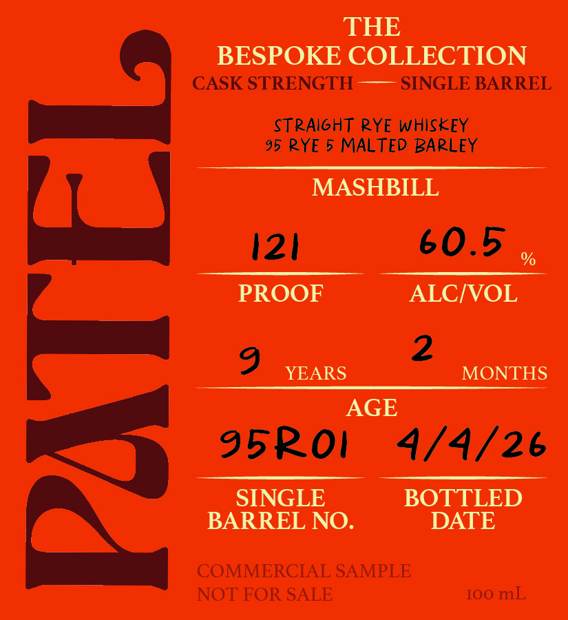

# TTB COLA Label Images - TTBID 26136001000094

**Brand Name:** PATEL STRAIGHT RYE WHISKEY

**Issue Date:** 06/09/2026

**Origin Code:** 08

**Product Class/Type:** 102

**Source:** [TTB Public COLA Registry](https://ttbonline.gov/colasonline/viewColaDetails.do?action=publicFormDisplay&ttbid=26136001000094)

## Label Images

### Front Label

### Label 2

## Extracted Label Text

*Text extracted via OCR - may contain errors*

**Detected Proof:** 121

### Front Label

THE
BESPOKE COLLECTION
CASK STRENGTH
SINGLE BARREL
STRAIGHT RYE WHISKEY
95 RYE 5 MALTED BARLEY
MASHBILL
121
60.5
PROOF
ALCIVOL
1
9
YEARSAGE
2
MONTHS
95roi
4/4/26
SINGLE
BOTTLED
BARREL NO.
DATE
COMMERCIAL SAMPLE
NOT FOR SALE
IoO mL

### Label 2

WED LOVE TO HEAR WHAT
YOU THOUGHT OF
THE EPICUREAN SELECTION:
SHARE YOUR REVIEW WITH US
ON INSTAGRAM
@PATELBOURBON
PATELBOURBONS.COM
DISTILLED IN INDIANA
BOTTLED BY RM ROSE CO.
MOUNT AIRY, GA
GOVERNMENT WARNING:
ACCORDING TO THE SURGEON GENERAL, WOMEN
SHOULD NOT DRINK ALCOHOLIC BEVERAGES DURING
PREGNANCY BECAUSE OF THE RISK OF BIRTH DEFECTS
(2) CONSUMPTION OF ALCOHOLIC BEVERAGES
IMPAIRS YOUR ABILITY TO DRIVE A CAR OR OPERATE
MACHINERY, AND MAY CAUSE HEALTHPROBLEMS.
