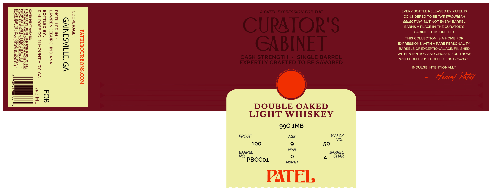

# TTB COLA Label Images - TTBID 26136001000098

**Brand Name:** CURATORS CABINET DOUBLE OAKED LIGHT WHISKEY

**Issue Date:** 05/21/2026

**Origin Code:** 08

**Product Class/Type:** 144

**Source:** [TTB Public COLA Registry](https://ttbonline.gov/colasonline/viewColaDetails.do?action=publicFormDisplay&ttbid=26136001000098)

## Label Images

### Label 1

## Extracted Label Text

*Text extracted via OCR - may contain errors*

**Detected Age:** 50 Years

### Label 1

ZEN:

BLO

Boe

ee}

EVERY BOTTLE RELEASED BY PATEL IS

BEa0)

ES ierd

> <

fowul

CONSIDERED TO BE THE EPICUREAN

ZnzD

<D2

OB

BSS

Com

oa =

SELECTION, BUT NOT EVERY BARREL

Pato

9g

Sad

Zz>im95

EARNS A PLACE IN THE CURATOR'S

Ze

itd

Seas

isos

22

OG:

am

S72

CABINET. THIS ONE DID.

Came

cn Z

co

Oe:

QF

£59

THIS COLLECTION IS A HOME FOR

oa

256

ame

—<O'

ASO

cm

EXPRESSIONS WITH A RARE PERSONALITY.

EEGQuZ

BARRELS OF EXCEPTIONAL AGE, FINISHED

Fou

Saeck

Teens

WITH INTENTION AND CHOSEN FOR THOSE

8

25x

Be

Pomn

BOOmy

WHO DON'T JUST COLLECT, BUT CURATE.

naanos

[si=fo}

a

B=

m ¥2Z

INDULGE INTENTIONALLY.

— Haney Py

—

DOUBLE OAKED

LIGHT WHISKEY

9g9C 1MB

PROOF

AGE

% ALC/

100

9

50

YEAR

BARREL

BARREL

Oo

4 CHAR

“° 5BCCo1

MONTH
