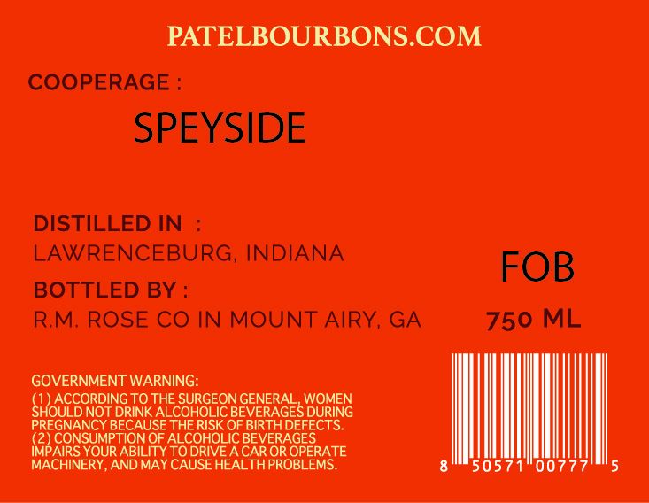
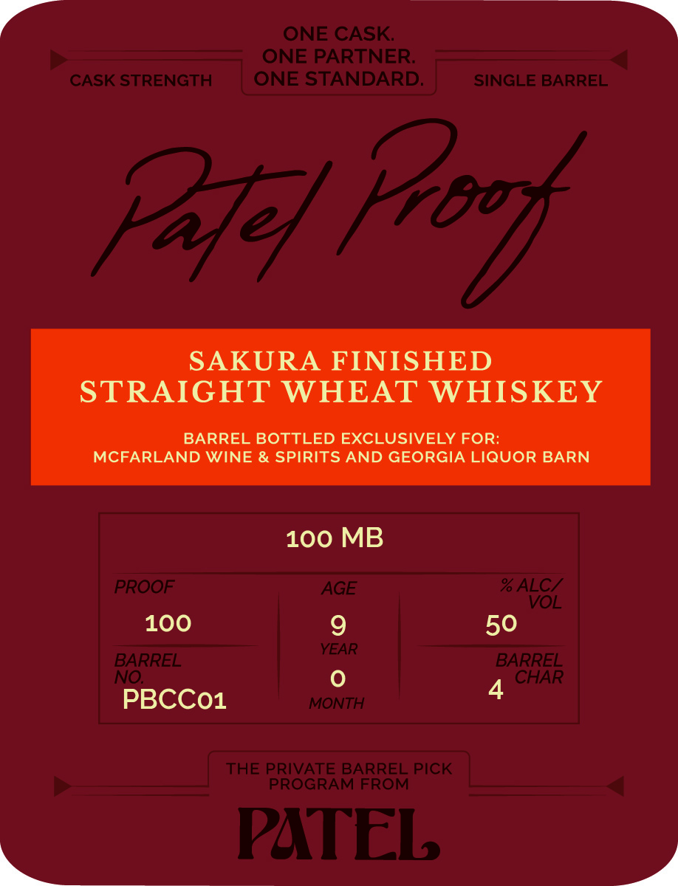

# TTB COLA Label Images - TTBID 26136001000101

**Brand Name:** PATEL PROOF SAKURA FINISHED STAIGHT WHEAT WHISKEY

**Issue Date:** 05/21/2026

**Origin Code:** 08

**Product Class/Type:** 109

**Source:** [TTB Public COLA Registry](https://ttbonline.gov/colasonline/viewColaDetails.do?action=publicFormDisplay&ttbid=26136001000101)

## Label Images

### Back Label

### Front Label

## Extracted Label Text

*Text extracted via OCR - may contain errors*

**Detected Age:** 50 Years

### Back Label

PATELBOURBONS.COM
COOPERAGE
SPEYSIDE
DISTILLED IN
LAWRENCEBURG, INDIANA
FOB
BOTTLED BY
RM; ROSE CO IN MOUNT AIRY, GA
750 ML
GOVERNMENT WARNING:
HOUCCORDING
TO THE SURGEON GENERAL WOMEN
NO
DRINK ALCOHOLIC
BEVERAGES DURING
REGNANC
BECAUSE THE RISK OL
BIRTHDEFECTS
CONSUMPTION OF ALCOHOLIC BEVERAGES
IMPAIRS YOUR ABILITY TO DRIVE A CAR OR OPERATE
MACHINERY, AND MAY CAUSE HEALTHPROBLEMS
5 057
007

### Front Label

ONE CASK
ONE PARTNER:
CASK STRENGTH
ONE STANDARD:
SINGLE BARREL
Pte]
SAKURA FINISHED
STRAIGHT WHEAT WHISKEY
BARREL BOTTLED EXCLUSIVELY FOR:
MCFARLAND WINE & SPIRITS AND GEORGIA LIQUOR BARN
100 MB
PROOF
AGE
% ALC/
VOL
100
9
50
YEAR
BARREL
BARREL
NO
CHAR
4
PBCCO1
MONTH
THE PRIVATE BARREL PICK
PROGRAM FROM
PATEL
Frbox
