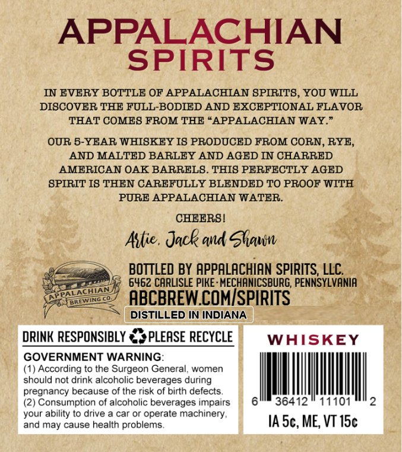
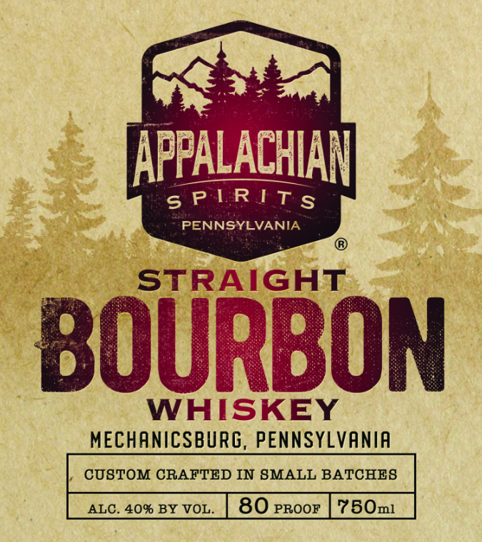

# TTB COLA Label Images - TTBID 26138001000022

**Brand Name:** APPALACHIAN SPIRITS

**Issue Date:** 05/22/2026

**Origin Code:** 39

**Product Class/Type:** 101

**Source:** [TTB Public COLA Registry](https://ttbonline.gov/colasonline/viewColaDetails.do?action=publicFormDisplay&ttbid=26138001000022)

## Label Images

### Back Label

### Front Label

## Extracted Label Text

*Text extracted via OCR - may contain errors*

### Back Label

APPALACHIAN
SPIRITS
IN EVERY BOTTLE OF APPALACHIAN SPIRITS, YOU WILL
DISCOVER THE FULL-BODIED AND EXCEPTIONAL FLAVOR
THAT COMES FROM THE
APPALACHIAN WAY"
OUR 5-YEAR WHISKEY IS PRODUCED FROM CORN, RYE_
AND MALTED BARLEY AND AGED IN CHARRED
AMERICAN OAK BARRELS . THIS PERFECTLY AGED
SPIRIT I8 THEN CAREFULLY BLENDED TO PROOF WITH
PURE APPALACHIAN WATER_
CHEERSI
Axtie . Jack ad Shawn
BOTTLED BY APPALACHIAN SPIRITS, LLC
6462 CARLISLE PIKE : MECHANICSBURG, PENNSYLVANIA
TNG
ABCBREW COMISPIRITS
DISTILLED IN INDIANA
DRINK RESPONSIBLY
PLEASE RECYCLE
WAISKEY
GOVERNMENT WARNING:
(1) According to the Surgeon General, women
should not drink alcoholic beverages during
pregnancy because of the risk of birth defects_
(2) Consumption of alcoholic beverages impairs
36412
11101
your ability to drive a car or operate machinery,
and may cause health problems
IA 5c, ME; VT 15c

### Front Label

APPALACHIAN

PLR IT.

PENNSYLVANIA

ve IGHT

AS

WHISKEY

MECHANICSBURG, PENNSYLVANIA

,/ CUSTOM CRAFTED IN SMALL BATCHES
