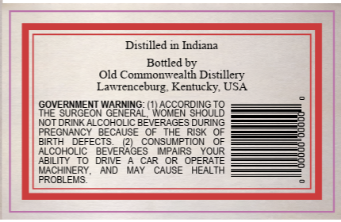
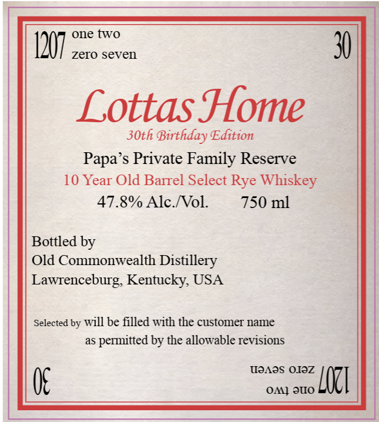

# TTB COLA Label Images - TTBID 26138001000088

**Brand Name:** LOTTAS HOME

**Issue Date:** 06/16/2026

**Origin Code:** 22

**Product Class/Type:** 142

**Source:** [TTB Public COLA Registry](https://ttbonline.gov/colasonline/viewColaDetails.do?action=publicFormDisplay&ttbid=26138001000088)

## Label Images

### Back Label

### Front Label

## Extracted Label Text

*Text extracted via OCR - may contain errors*

**Detected Proof:** 95.6
**Detected Age:** 10 Years

### Back Label

Distilled in Indiana
Bottled by
Old Commonwealth Distillery
LawtenceburgKentucky USA
SQVERRGE
THE
WRNNG: (WeGGoRBHGU
NOT
INK ALCOHOLIC BE
GES DURING
EGNANCY
BECAUSE
RISK
RIH
FFEC
CONSI
ALCOHOLIC
BEVeRRGES
ABILITY
TODRIVE
CAR
LACHINERY ,
May
CAUSE
HEALTH
PROBLEMS
'QINd?
AND

### Front Label

one two
1207
zero seven
30
Lottas Home
3Oth
Birthday Edition
Papa's Private Family Reserve
10 Year Old Barrel Select Rye Whiskey
47.8% Alc_Nol
750 ml
Bottled by
Old Commonwealth Distillery
Lawrenceburg, Kentucky; USA
Selected by
be filled with the customer name
as
permitted by the allowable revisions
MOAos OIOZ
OMJ JUO
LOZI
will
