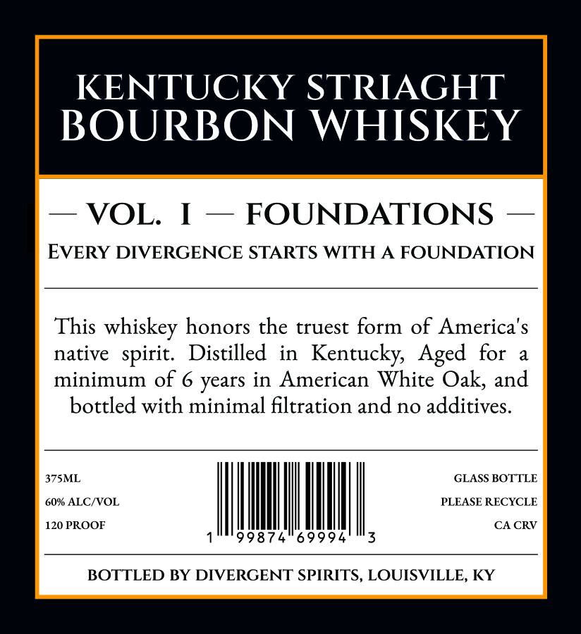
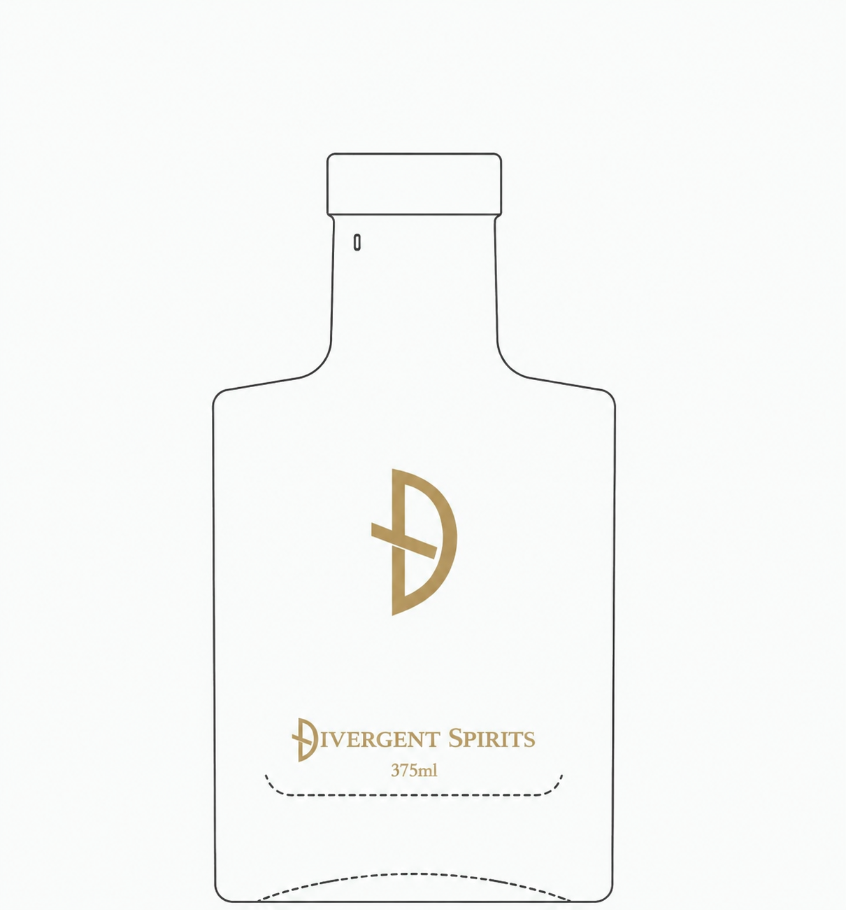
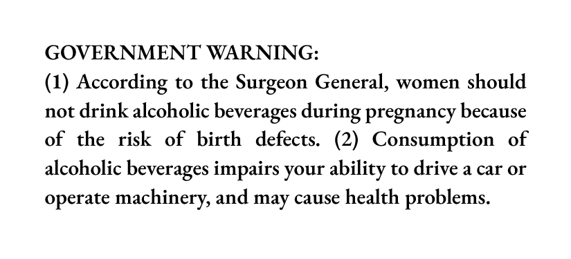

# TTB COLA Label Images - TTBID 26138001000110

**Brand Name:** DIVERGENT SPIRITS

**Issue Date:** 05/21/2026

**Origin Code:** 22

**Product Class/Type:** 101

**Source:** [TTB Public COLA Registry](https://ttbonline.gov/colasonline/viewColaDetails.do?action=publicFormDisplay&ttbid=26138001000110)

## Label Images

### Label 1

### Label 2

### Label 3

### Label 4

## Extracted Label Text

*Text extracted via OCR - may contain errors*

*1 image(s) excluded: text did not meet readability threshold*

**Detected Proof:** 120
**Detected Age:** 6 Years

### Label 1

KENTUCKY STRIAGHT
BOURBON WHISKEY

— VOL. I — FOUNDATIONS —

EVERY DIVERGENCE STARTS WITH A FOUNDATION

This whiskey honors the truest form of America's

native spirit. Distilled in Kentucky, Aged for a

minimum of 6 years in American White Oak, and
bottled with minimal filtration and no additives.

375ML
60% ALC/VOL,
120 PROOF
qed

GLASS BOTTLE
PLEASE RECYCLE
3

9874569994

CACRV

BOTTLED BY DIVERGENT SPIRITS, LOUISVILLE, KY

### Label 3

VOL_
1
KENTUCKY STRAIGHT BOURBON WHISKEY
60% ABV
120 PROOF

### Label 4

GOVERNMENT WARNING:

(1) According to the Surgeon General, women should

not drink alcoholic beverages during pregnancy because

of the risk of birth defects. (2) Consumption of

alcoholic beverages impairs your ability to drive a car or

operate machinery, and may cause health problems.
