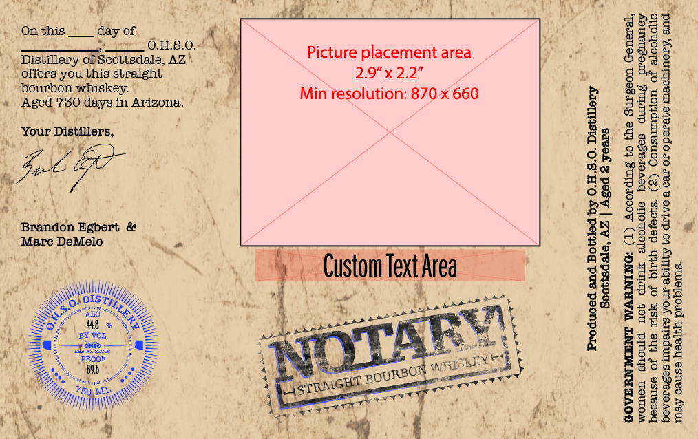

# TTB COLA Label Images - TTBID 26138001000282

**Brand Name:** O.H.S.O.

**Fanciful Name:** NOTARY

**Issue Date:** 05/22/2026

**Origin Code:** 11

**Product Class/Type:** 101

**Source:** [TTB Public COLA Registry](https://ttbonline.gov/colasonline/viewColaDetails.do?action=publicFormDisplay&ttbid=26138001000282)

## Label Images

### Label 1

## Extracted Label Text

*Text extracted via OCR - may contain errors*

**Detected Age:** 2 Years

### Label 1

Af » ao bt ig 4 Pi
, p ; Aah a
On this ate of Ass
pier 0.1.8.0. Ke
Distillery oPScousdale, AZ” Picture placement area
offers you this straight } 2.9"x 2.2”

bourbon whiskey. Fy tan?
«Aged 780 days in Arizona: Min resolution: 870 x 660

Your Distillers,

Joe

Brandon Egbert & rl
Marc DeMelo a *

ut Custom Tet rea

SAS

RE nly -

S casi Le <

, S 4B x he
‘ #8
" WHIORELESS §
= fh i

Scottsdale, AZ | Aged 2 years
GOVERNMENT WARNING: (1) According to the Surgeon General,
women should not drink alcoholic beverages during pregnancy
because of the risk of birth defects. (2) Consumption of alcoholic
x

” Produced and Bottled by 0.H.8.0. Distillery
beverages impairs your ability to drive a car or operate machinery, and.

may cause health problems.
