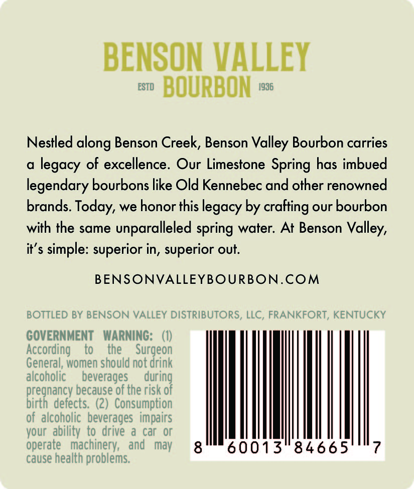
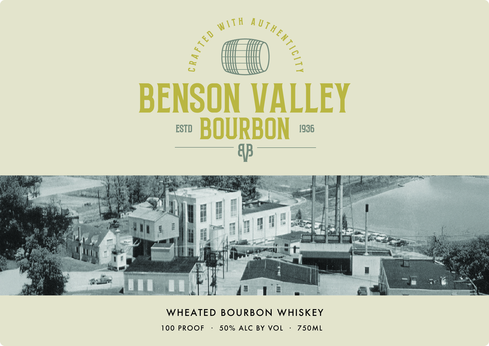

# TTB COLA Label Images - TTBID 26138001000336

**Brand Name:** BENSON VALLEY BOURBON

**Issue Date:** 05/27/2026

**Origin Code:** 22

**Product Class/Type:** 141

**Source:** [TTB Public COLA Registry](https://ttbonline.gov/colasonline/viewColaDetails.do?action=publicFormDisplay&ttbid=26138001000336)

## Label Images

### Back Label

### Front Label

### Label 2

## Extracted Label Text

*Text extracted via OCR - may contain errors*

*2 image(s) excluded: text did not meet readability threshold*

### Back Label

BENSON VALLEY
EST
BOURBON
1936
Nestled
Benson Creek, Benson
Bourbon carries
of excellence. Our Limestone Spring has imbued
legendary bourbons like Old Kennebec and other renowned
brands.
we honor this
by crafting our bourbon
with the same
unparalleled spring water: At Benson
i $ simple: superior in, superior out.
BENSONVALLEYBOURBON.COM
BOTTLED BY BENSON VALLEY DISTRIBUTORS, LLC, FRANKFORT, KENTUCKY
GOVERNMENT
WARNING:   (0)
According
to
the
Surgeon
General, women should not drink
alcoholic
beverages
duriog
pregnancy because of the risk =
birth defects: (2)   Consumption
of alcoholic   beverages   impairs
vour  ability to  drive
a car Or
operate   machinery,   and
may
8
60013
84665
7
cause health problems:
along
Valley
legacy
Today;
legacy
Valley,
