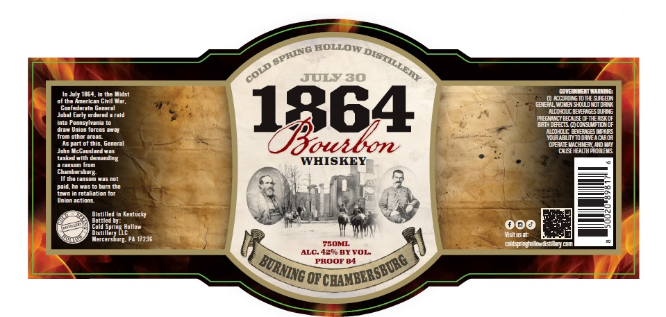

# TTB COLA Label Images - TTBID 26138001000399

**Brand Name:** COLD SPRING HOLLOW DISTILLERY

**Fanciful Name:** 1864 BOURBON

**Issue Date:** 05/21/2026

**Origin Code:** 39

**Product Class/Type:** 141

**Source:** [TTB Public COLA Registry](https://ttbonline.gov/colasonline/viewColaDetails.do?action=publicFormDisplay&ttbid=26138001000399)

## Label Images

### Label 1

## Extracted Label Text

*Text extracted via OCR - may contain errors*

**Detected Proof:** 84

### Label 1

HOLLOW
JULY 30
July 1864. In tha Midst
covemgtottesiagat
of the Amarican Civil Mar,
GBE
LaTsom
gontadarate banarai
ncohoicc BEIERIGBWANG
Jubal Early urdeted & rald
PeincpeWgE CE THEAEYOF
Inte Pimios} iorces % m
1364
TDzOE65
fton OtharAnans
YourabL
Ttodaneacror
Ganenl
DPERAIEWIcH
Jond Acgavsiandmas
DSEEDTTE
tasked Kith damanding
WHISKEY
HahatWmuljm
Ghamdetsovg
the ransom 4a5 Mot
paid;ha 4as
Hnemnnatalathoment
Uniomactiona_
Distilled
Kentucty
Bottled DYt
Cold Sprlng Hollow
D0
Distillery llc
Visitus a1
Metcersburg: PA 17236
75OML
eldspingelbudsb
ALC. 4290 BYVOL
PROOF 84
OF
SPRING _
DISTILLERY
COLD =
otmbig;
"CBAMBERSBORG
BURNING C
