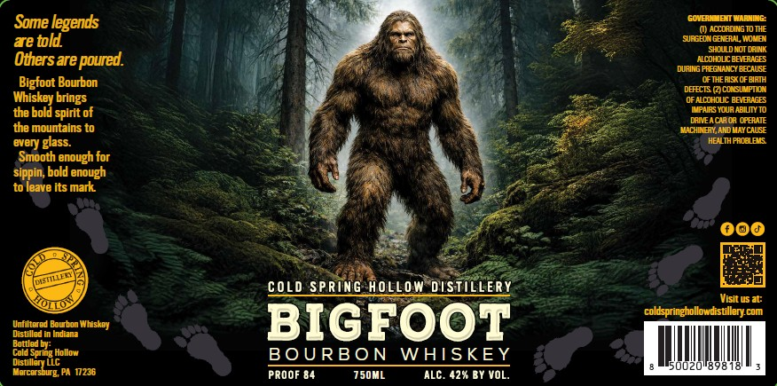

# TTB COLA Label Images - TTBID 26138001000407

**Brand Name:** COLD SPRING HOLLOW DISTILLERY

**Fanciful Name:** BIGFOOT BOURBON

**Issue Date:** 05/27/2026

**Origin Code:** 39

**Product Class/Type:** 141

**Source:** [TTB Public COLA Registry](https://ttbonline.gov/colasonline/viewColaDetails.do?action=publicFormDisplay&ttbid=26138001000407)

## Label Images

### Label 1

## Extracted Label Text

*Text extracted via OCR - may contain errors*

### Label 1

Some legends
GoveM
Warnie
W accordingTo THE
ae told
SurGEMGEIERAL mova
skliLdCI LaNk
Othersare poured
acohocbamrAGES
DURING PFEGNANCY BECAUSE
Bigfoot Bourbon
OFTHERISK OFBIRTH
DEFCTS (2colslMpTION
Whiskey
ofncohouc beveGB
the bold spirit of
KphksVva abi
DaNEAcA €A OPERATE
the mountains to
MACHMNEY,AND MaY CauSE
every glass:
HEALTH PRLALENS
Smooth enough for
sippin, bold enough
t0 Ieave Its mark
COLD SpRinG HOLLOW DISJILLERY
Visit us at:
coldspringhollowdistillery com
Unfiltered Bourbon Wheskey
BIGFOOT
Distilled In Indiana
E7s4n
Hollow
BOURB ON
WHISKEY
Distillery LLC
Mozm
Mercetsbug; PA 1236
PROOF 84
750ML
ALC. 427 By VOL.
brings
