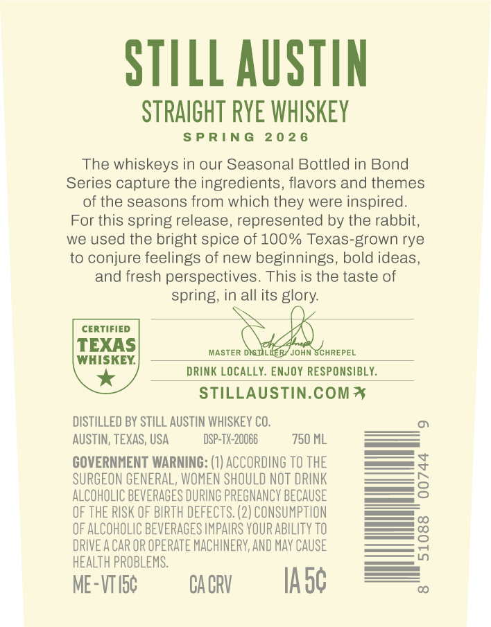
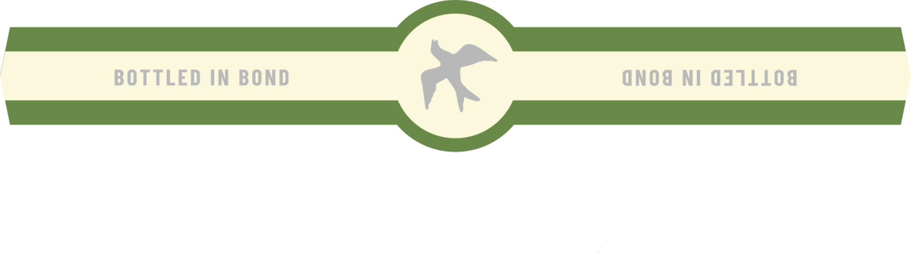

# TTB COLA Label Images - TTBID 26138001000453

**Brand Name:** STILL AUSTIN

**Fanciful Name:** BOTTLED IN BOND STRAIGHT RYE WHISKEY

**Issue Date:** 05/21/2026

**Origin Code:** 44

**Product Class/Type:** 112

**Source:** [TTB Public COLA Registry](https://ttbonline.gov/colasonline/viewColaDetails.do?action=publicFormDisplay&ttbid=26138001000453)

## Label Images

### Back Label

### Front Label

## Extracted Label Text

*Text extracted via OCR - may contain errors*

*1 image(s) excluded: text did not meet readability threshold*

### Back Label

STILL AUSTIN

STRAIGHT RYE WHISKEY

SPRING 2026

The whiskeys in our Seasonal Bottled in Bond

Series capture the ingredients, flavors and themes

of the seasons from which they were inspired.

For this spring release, represented by the rabbit,

we used the bright spice of 100% Texas-grown rye

to conjure feelings of new beginnings, bold ideas,

and fresh perspectives. This is the taste of

spring, in all its glory.

CERTIFIED

WHISKEY.

TEXAS

MASTER

JOHN SCHREPEL

DRINK LOCALLY. ENJOY RESPONSIBLY.

STILLAUSTIN.COM 4

DISTILLED BY STILL AUSTIN WHISKEY CO.

AUSTIN, TEXAS, USA

DSP-TX-20066

750 ML

GOVERNMENT WARNING: (1) ACCORDING TO THE

SURGEON GENERAL, WOMEN SHOULD NOT DRINK

ALCOHOLIC BEVERAGES DURING PREGNANCY BECAUSE

OF THE RISK OF BIRTH DEFECTS. (2) CONSUMPTION

OF ALCOHOLIC BEVERAGES IMPAIRS YOUR ABILITY T0

_——e

DRIVE ACAR OR OPERATE MACHINERY, AND MAY CAUSE

—-=

HEALTH PROBLEMS.

ME-VTI5¢

CACRY

lAoG
