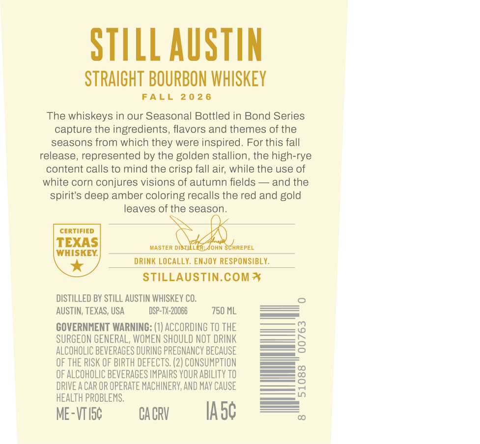
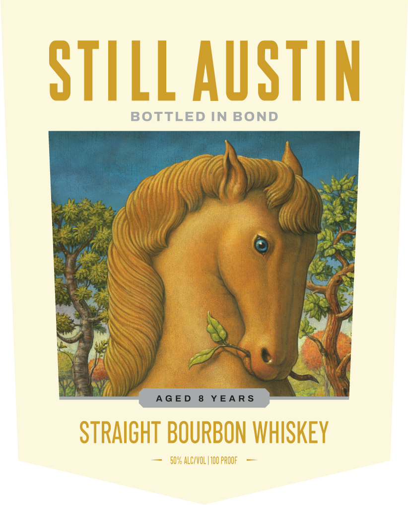

# TTB COLA Label Images - TTBID 26138001000469

**Brand Name:** STILL AUSTIN

**Fanciful Name:** BOTTLED IN BOND STRAIGHT BOURBON WHISKEY

**Issue Date:** 05/22/2026

**Origin Code:** 44

**Product Class/Type:** 111

**Source:** [TTB Public COLA Registry](https://ttbonline.gov/colasonline/viewColaDetails.do?action=publicFormDisplay&ttbid=26138001000469)

## Label Images

### Back Label

### Front Label

### Label 3

## Extracted Label Text

*Text extracted via OCR - may contain errors*

*1 image(s) excluded: text did not meet readability threshold*

**Detected Proof:** 100

### Back Label

STILL AUSTIN

STRAIGHT BOURBON WHISKEY

FALL 2026

The whiskeys in our Seasonal Bottled in Bond Series
capture the ingredients, flavors and themes of the
seasons from which they were inspired. For this fall
release, represented by the golden stallion, the high-rye
content calls to mind the crisp fall air, while the use of
white corn conjures visions of autumn fields — and the
Spirit's deep amber coloring recalls the red and gold
leaves of the season.

(a)
CERTIFIED WAL
TEXAS wasren dsc CEE doit ncPet

WHISKEY.
* DRINK LOCALLY. ENJOY RESPONSIBLY.

STILLAUSTIN.COM

DISTILLED BY STILL AUSTIN WHISKEY CO. °
AUSTIN, TEXAS, USA DSP-TX-20066 750 ML

GOVERNMENT WARNING: (1) ACCORDING TO THE
SURGEON GENERAL, WOMEN SHOULD NOT DRINK
ALCOHOLIC BEVERAGES DURING PREGNANCY BECAUSE
OF THE RISK OF BIRTH DEFECTS. (2) CONSUMPTION
OF ALCOHOLIC BEVERAGES IMPAIRS YOUR ABILITY TO
DRIVE A CAR OR OPERATE MACHINERY, AND MAY CAUSE
HEALTH PROBLEMS.

ME-vrise §=»scacry «= WANG

51088 00763

8

### Front Label

StILL AuSTIN
BOTTLED IN BOND
A G E D
YEAR S
STRAIGHT BOURBON WHISKEY
509 ALC/VOL | 100 PROOF
