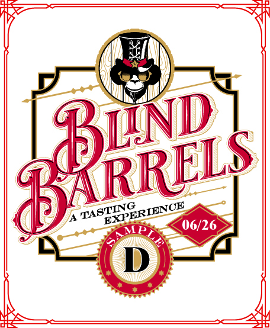
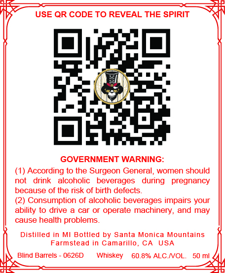

# TTB COLA Label Images - TTBID 26138001000470

**Brand Name:** BLIND BARRELS

**Issue Date:** 05/21/2026

**Origin Code:** 01

**Product Class/Type:** 140

**Source:** [TTB Public COLA Registry](https://ttbonline.gov/colasonline/viewColaDetails.do?action=publicFormDisplay&ttbid=26138001000470)

## Label Images

### Back Label

### Front Label

## Extracted Label Text

*Text extracted via OCR - may contain errors*

*1 image(s) excluded: text did not meet readability threshold*

**Detected Proof:** 121.6

### Front Label

USE QR CODE TO REVEAL THE SPIRIT
GOVERNMENT WARNING:
According to the Surgeon General,
women should
not
drink
alcoholic
beverages
during
pregnancy
because of the risk of birth defects_
Consumption of alcoholic beverages impairs your
ability to drive a
car or operate machinery,
may
cause health problems_
Distilled
in MI Bottled by Santa Monica Mountains
Farmstead in Camarillo
CA
USA
Blind Barrels
0626D
Whiskey
60.8%
ALC NOL
50 ml
and
