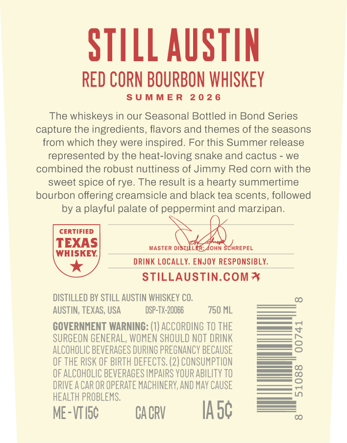
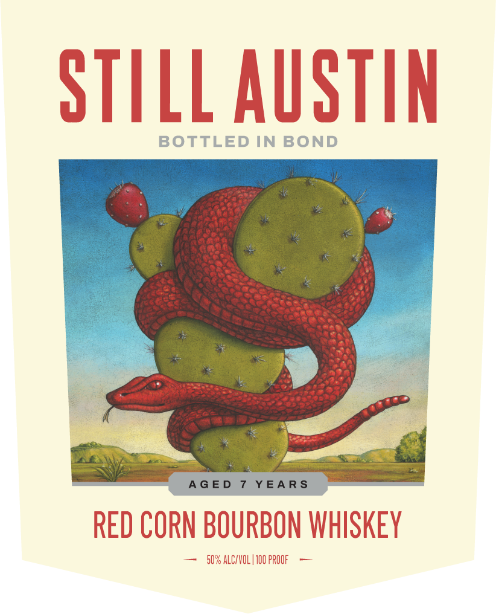
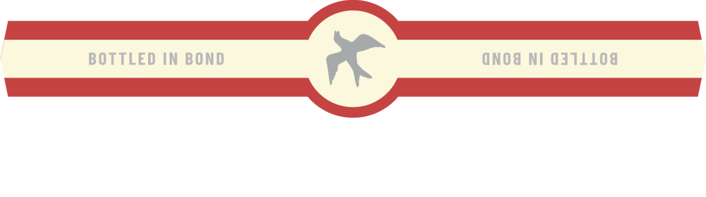

# TTB COLA Label Images - TTBID 26138001000484

**Brand Name:** STILL AUSTIN

**Fanciful Name:** BOTTLED IN BOND RED CORN BOURBON WHISKEY

**Issue Date:** 05/22/2026

**Origin Code:** 44

**Product Class/Type:** 111

**Source:** [TTB Public COLA Registry](https://ttbonline.gov/colasonline/viewColaDetails.do?action=publicFormDisplay&ttbid=26138001000484)

## Label Images

### Back Label

### Front Label

### Label 3

## Extracted Label Text

*Text extracted via OCR - may contain errors*

*1 image(s) excluded: text did not meet readability threshold*

**Detected Proof:** 100

### Back Label

STILL AuSTIN
RED CORN BOURBON WHISKEY
S U MM E R
2 0 2 6
The whiskeys in our Seasonal Bottled in Bond Series
capture the ingredients, flavors and themes of the seasons
from which
were inspired. For this Summer release
represented by the heat-loving snake and cactus
we
combined the robust nuttiness of Jimmy Red corn with the
sweet spice of rye_
The result is a hearty summertime
bourbon offering creamsicle and black tea scents, followed
by a playful palate of peppermint and marzipan_
CERTIFIED
TEXAS
MASTER DISTM
JOHN SCHREPEL
WHISKEY
DRINK LOCALLY. ENJOY RESPONSIBLY
STILLAUSTIN.CoMT
DISTILLED BY STILL AUSTIN WHISKEY CO.
AUSTIN, TEXAS, USA
DSP-TX-20066
750 ML
COVERNMENT WARNING: (1) ACCORDING TO THE
SURGEON GENERAL, WOMEN SHOULD NOT DRINK
3
ALCOHOLIC BEVERAGES DURING PREGNANCY BECAUSE
OF THE RISK OF BIRTH DEFECTS. (2) CONSUMPTION
OF ALCOHOLIC BEVERAGES IMPAIRS VOUR ABILITY TO
DRIVE A CAR OR OPERATE MACHINERV, AND Mav CAUSE
3
HEALTH PROBLEMS
ME-VTIsc
CA CRV
Ia5c
they

### Front Label

StILlAuStn
BOTTLED IN BOND
A G E D
YEA R$
RED CORN BOURBON WHISKEY
50% ALC/VOL | 100 PROOF
